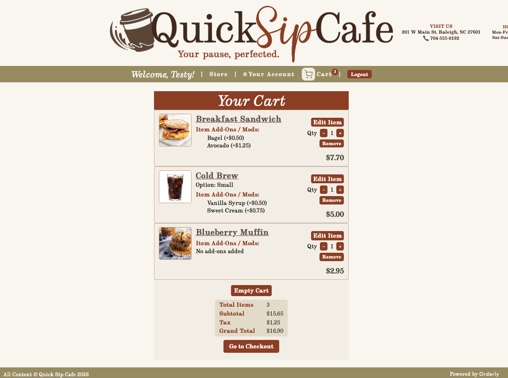
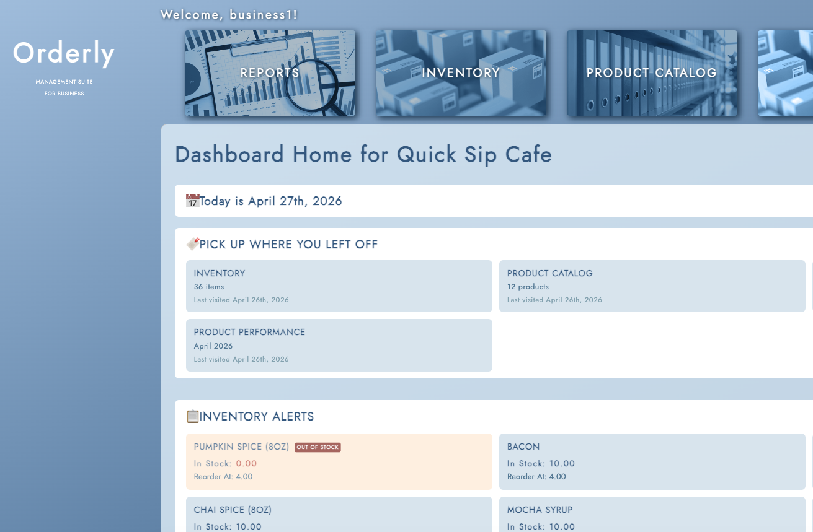
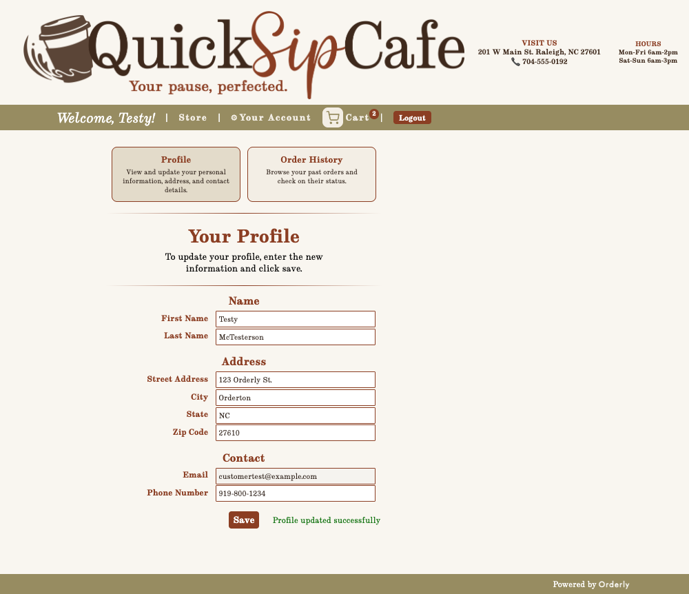
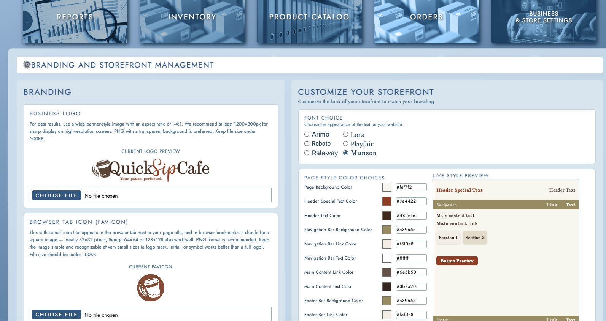

# 🧾 Orderly

## Fast, Flexible Ordering for Any Business

Orderly is a flexible, full-stack, self-service ordering and business management platform built for small to mid-sized businesses that need an intuitive, affordable way to manage customer orders and business operations — all from one place.

------

## 📌 About the Project

Traditional ordering systems are either too complex or too expensive for smaller operations. Orderly solves this with a clean, responsive customer-facing interface and a business admin dashboard that puts real control in the hands of owners and staff.

Customers can browse, customize, and submit orders with confidence. Admins can manage products, monitor inventory, and track sales — all backed by a secure, role-separated API.

------

## ✨ Features

### Customer Experience

- [x] User registration, login, and JWT-based authentication
- [x] Email verification and password reset workflows
- [x] Product browsing with categories, variants, and modifier customization
- [x] Persistent shopping cart backed by a DRAFT order
- [x] Order submission (DRAFT → PENDING) with confirmation and receipt
- [x] Customer profile management

### Business Admin Tools

- [x] Role-based access control — customer and business roles enforced server-side
- [x] Admin dashboard navigation
- [x] Product and variant management (create, update, delete)
- [x] Inventory management with real-time stock level tracking
- [x] Low stock indicators and visual flags
- [x] Sales summary dashboard — total revenue, order count, top-selling products
- [x] Admin settings page — branding, storefront customization, business profile

### Platform & Infrastructure

- [x] RESTful API with versioned endpoints (`/api/v1/`)
- [x] GitHub Actions CI/CD pipeline (Django/pytest + React/Node)
- [x] Robot Framework E2E test suite (SeleniumLibrary)
- [x] Seed data for local development and testing
- [x] Docker Compose local deployment
- [x] AWS EC2 + RDS production deployment

### Stretch Goals

- [ ] Payment gateway integration
- [ ] Supplier management module
- [ ] Loyalty programs and customer analytics
- [ ] Multi-location support

------

## 📸 Screenshots

### Customer Experience

**Shopping Cart** 

**Admin Dashboard** 

**Sales Report** 

**Business Settings** 

------

## 🗂️ Data Model Overview

```
auth.User
    └── CustomerProfile (user OneToOne)
    └── BusinessProfile (user OneToOne)

Product
    ├── ProductVariant (product FK)
    │       size, price, stock_quantity
    └── ModifierGroup (product FK)
            └── ModifierOption (group FK)
                    name, price_delta

Order (customer FK)
    └── OrderItem (order FK)
            ├── ProductVariant (variant FK)
            └── OrderItemModifier (item FK)
```

------

## 🛠️ Tech Stack

| Layer           | Technology                                                |
| --------------- | --------------------------------------------------------- |
| Frontend        | React 18, React Router v6, Axios                          |
| Backend         | Django 4.x, Django REST Framework                         |
| Authentication  | SimpleJWT (Access + Refresh tokens)                       |
| Database        | MySQL 8.0                                                 |
| Testing         | pytest (backend), Robot Framework + SeleniumLibrary (E2E) |
| CI/CD           | GitHub Actions                                            |
| Deployment      | Docker Compose, AWS EC2 + RDS                             |
| Version Control | Git / GitHub                                              |

------

## ⚙️ Getting Started

### Option 1: Docker (Recommended)

The fastest way to run Orderly locally. Works on Windows, macOS, and Linux.

#### Prerequisites

- [Docker Desktop](https://www.docker.com/products/docker-desktop/)
- Git

#### Setup

1. Verify Docker is installed:

```bash
docker --version
docker compose version
```

1. Clone the repository and switch to the local distribution branch:

```bash
git clone https://github.com/[your-username]/Orderly.git
cd Orderly
```

> Switch to the `feat_local-Docker-Dist` branch for the Docker-ready build.

1. Create environment files:

```bash
cp example-env-backend.txt .env
cp example-env-frontend.txt frontend/.env
```

> Open both files and replace the `<CHANGEME>` placeholders with secure passwords before continuing.

1. Build and start the application:

```bash
docker compose up --build
```

1. Run database migrations (MySQL may take a moment to initialize — wait a few seconds before running this):

```bash
docker compose exec backend python manage.py migrate
```

1. Seed demo data (optional):

```bash
docker compose exec backend python manage.py seed_data
docker compose exec backend python manage.py seed_customers
docker compose exec backend python manage.py seed_orders
```

The frontend is available at `http://localhost:3000` and the API at `http://localhost:8000`.

#### Managing the Container

```bash
docker compose up        # Start, rebuild, and view logs
docker compose start     # Start a stopped, previously built container
docker compose down      # Stop a running container
```

#### Uninstalling

```bash
docker compose down                  # Stop and remove containers and networks
docker compose down -v               # Also remove volumes
docker compose down --rmi all -v     # Full wipe — removes all containers, networks, volumes, and images
```

------

### Option 2: Manual Setup

For contributors who prefer a direct development environment without Docker.

#### Prerequisites

- Python 3.x
- Node.js
- MySQL **8.4.8 LTS**
- Git

#### 1. Clone the Repository

```bash
git clone https://github.com/[your-username]/Orderly.git
cd Orderly
```

#### 2. Database Setup

**Install MySQL 8.4.8 LTS**

**Windows:** Go to [mysql.com](https://www.mysql.com/) → Downloads → MySQL Community (GPL) Downloads → MySQL Community Server. Select version **8.4.8 LTS** and download the MSI installer. Run the installer (select **Typical**), then complete the MySQL Configurator:

- Choose **Development Computer**
- Keep the default port: `3306`
- Create a root password and store it safely
- Apply changes → Execute → Finish

**macOS:** Install via Homebrew:

```bash
brew install mysql@8.4
brew services start mysql@8.4
```

Then secure the installation:

```bash
mysql_secure_installation
```

**Connect to MySQL** (both platforms):

```bash
mysql -u root -p
```

> **Windows only:** If this fails, add `MySQL\MySQL Server 8.4\bin` to your PATH environment variable using the full installation path.

**Create the database and user:**

```sql
CREATE DATABASE orderly
CHARACTER SET utf8mb4
COLLATE utf8mb4_unicode_ci;

CREATE USER 'orderly_user'@'localhost'
IDENTIFIED BY 'localdevpass';

GRANT ALL PRIVILEGES ON orderly.* TO 'orderly_user'@'localhost';

FLUSH PRIVILEGES;
```

<details> <summary>Verify your setup</summary>

```sql
-- Confirm the database exists
SHOW DATABASES;

-- Confirm utf8mb4 encoding
SHOW CREATE DATABASE orderly;
-- Expected: DEFAULT CHARACTER SET utf8mb4 COLLATE utf8mb4_unicode_ci

-- Confirm the user was created
SELECT User, Host FROM mysql.user;

-- Confirm privileges
SHOW GRANTS FOR 'orderly_user'@'localhost';
-- Expected: GRANT ALL PRIVILEGES ON `orderly`.* TO `orderly_user`@`localhost`
```

</details>

Open `backend/orderly/settings.py` and confirm the `DATABASES` block matches:

```python
DATABASES = {
    "default": {
        "ENGINE": "django.db.backends.mysql",
        "NAME": "orderly",
        "USER": "orderly_user",
        "PASSWORD": "localdevpass",
        "HOST": "127.0.0.1",
        "PORT": "3306",
        "OPTIONS": {
            "init_command": "SET sql_mode='STRICT_TRANS_TABLES'",
        },
    }
}
```

#### 3. Backend Setup

**Windows (PowerShell):**

```powershell
python -m venv .venv
.venv\Scripts\Activate.ps1
pip install -r requirements.txt
cd backend
python manage.py migrate
python manage.py runserver
```

**macOS/Linux:**

```bash
python3 -m venv .venv
source .venv/bin/activate
pip install -r requirements.txt
cd backend
python3 manage.py migrate
python3 manage.py runserver
```

#### 4. Frontend Setup

**Windows (PowerShell):**

```powershell
cd Orderly/frontend
npm install
npm start
```

**macOS/Linux:**

```bash
cd Orderly/frontend
npm install
npm start
```

> Ignore vulnerability warnings from `npm install`.

Visit `http://localhost:3000` for the frontend and `http://localhost:8000/api/v1/` for the API.

------

### Running Tests

**Backend unit tests:**

```bash
# From Orderly/backend
pip install -r ../requirements.txt
python manage.py migrate --noinput
pytest --tb=short -v
```

**Frontend checks:**

```bash
# From Orderly/frontend
npm install
npm run lint
npm test
```

------

### CI/CD Pipeline

Every pull request to `main` runs three automated checks via GitHub Actions:

| Job                 | What Runs                                                    |
| ------------------- | ------------------------------------------------------------ |
| **Backend Tests**   | Spins up MySQL 8.0, runs migrations, seeds database, runs full pytest suite |
| **Frontend Checks** | Installs dependencies, verifies `react-router-dom`, runs CI smoke tests |
| **E2E Tests**       | Spins up MySQL 8.0, starts Django + React dev servers, runs Robot Framework suite (SeleniumLibrary, headless) |

All three checks must pass before a PR is eligible to merge. After pushing, open your pull request on GitHub — check statuses appear near the bottom of the PR page. Click **Details** on any check to see the full log output.

#### Seed Data

The CI pipeline seeds the database using `python manage.py seed_data --seed=42`. This creates a reproducible dataset including:

- Users: `customer1` through `customer5` with password `Password123!`
- Products, variants, categories, suppliers, and orders

The same seed command can be used locally to match the CI environment.

To flush and reseed a local database from a clean state, run the following from the `backend/` directory with your virtual environment active:

**macOS/Linux:**

```bash
python3 manage.py flush --no-input
python3 manage.py migrate  # required between flush and reseed
python3 manage.py seed_data --seed=42
python3 manage.py seed_customers
python3 manage.py seed_orders
```

**Windows (PowerShell):**

```powershell
python manage.py flush --no-input
python manage.py migrate  # required between flush and reseed
python manage.py seed_data --seed=42
python manage.py seed_customers
python manage.py seed_orders
```

See [CONTRIBUTING.md](https://claude.ai/docs/StandardsAndProcedures/CONTRIBUTING.md) for the full workflow.

------

## 🔒 Security

Authentication is handled via JWT — access tokens expire after 1 hour, with rotation via HTTP-only refresh token cookies. Role-based access control separates customer and business permissions, enforced server-side on every protected endpoint. All API communication uses HTTPS, and all inputs are validated to guard against injection attacks.

------

## 🎓 Academic Context

**Course:** CSC 289 — Programming Project Capstone
 **Institution:** Wake Technical Community College
 **Instructor:** Professor Alex Tabbal
 **Methodology:** Agile Scrum (6 two-week sprints)

**Team 7:**

| Name             | Role                                  |
| ---------------- | ------------------------------------- |
| Serina Rodriguez | Scrum Master / Project Manager        |
| Kim Mayo         | Product Owner, Full-Stack Development |
| Tristin Gatt     | Software Architect, Backend Lead      |
| Rachel Mizer     | Frontend Development Lead             |
| Caleb Fowlkes    | Technical Writer, Code Review Lead    |
| Kenny Bacdayan   | QA / Testing Lead                     |

*Special thanks to Tyler Royal, who contributed as Presentation Lead during the first half of the project.*

------

*Last updated: April 27, 2026*
