# Sprint 2 Test Cases
Project: **Orderly**
Sprint: **Sprint 2 — Backend Foundations & Authentication**

---

## US2.1 — Database Schema

### Test Case ID:
TC-2.1-01

### Feature:
Database Schema

### User Story:
As a developer, I want a properly structured database so that all application data is stored securely and efficiently.

### Preconditions:
- MySQL server running locally  
- Clean database available  
- Django configured for MySQL  
- Sprint 2 migrations present for:
  - accounts  
  - catalog  
  - inventory  
  - suppliers  
  - orders  

### Test Steps:

#### Step A — Migration Integrity
1. Run `python manage.py makemigrations`  
2. Run `python manage.py migrate`  
3. Re-run `python manage.py migrate`  
4. Run `python manage.py showmigrations`  

**Expected Result**
- No migration errors  
- Second migrate shows no pending migrations  
- All Sprint 2 migrations marked applied  

#### Step B — Physical Schema Verification
1. Connect to MySQL  
2. Execute `SHOW TABLES;`  
3. Query foreign keys via `INFORMATION_SCHEMA.KEY_COLUMN_USAGE`  

**Expected Result**
- Core domain tables exist  
- Django system tables exist  
- Foreign key constraints enforced across apps  

#### Step C — Relational Usability (Happy Path)
1. Open Django shell  
2. Create linked records:

Supplier → Category → Product → ProductVariant →  
CustomerProfile → Order → OrderItem  

**Expected Result**
- Records save successfully  
- Foreign keys resolve correctly  
- Duplicate product constraint enforced  
- No ORM or database integrity errors  


### Actual Result:
All migrations applied successfully.  
MySQL verification confirmed table creation and enforced foreign keys.  
Linked relational records created successfully.  
Duplicate product constraint correctly enforced.  

### Evidence

**Figure 1 – Successful migration execution**  
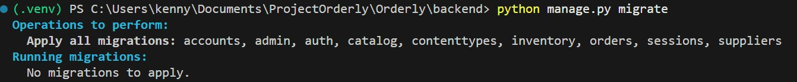

**Figure 2 – showmigrations confirmation**  


**Figure 3 – MySQL table creation**  


**Figure 4 – Relational record creation in Django shell**  
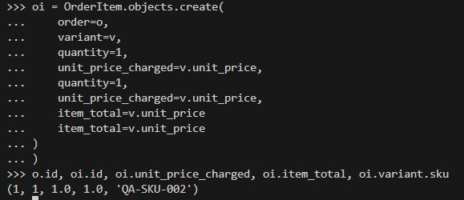

### Status:
PASS

### Notes:
Confirms foundational database readiness required for all Sprint 2 features.

---

## US2.2 — Database Validation

### Test Case ID:
TC-2.2-01

### Feature:
Database Validation

### User Story:
As a developer, I want to validate database constraints and relationships so that data integrity is maintained throughout the application.

### Preconditions:

- Application is running locally.
- Database migrations have been successfully applied.
- Django Admin is accessible.
- A superuser account exists.
- Test users exist with different roles (e.g., CUSTOMER and BUSINESS).
- Backend API endpoints are accessible.

### Test Steps:

1. Log in to Django Admin as a superuser.

2. Navigate to Customer Profiles.

3. Attempt to create a CustomerProfile with missing required fields.

4. Attempt to create a CustomerProfile with an invalid state format.

5. Attempt to create a CustomerProfile with an invalid ZIP code format.

6. Attempt to create a CustomerProfile for a user whose role is BUSINESS.

7. Attempt to create multiple CustomerProfiles for the same user.

8. Attempt to register two users through the API using the same email address.

9. Verify relationships between User and CustomerProfile enforce referential integrity.

10. Attempt to save each invalid entry.

### Expected Result:
- Required field validation prevents incomplete records from being saved.

- Invalid state or ZIP code formats are rejected.

- Duplicate records violating unique constraints are rejected.

- Cross-field validation prevents CustomerProfiles from being created for non-CUSTOMER users.

- Referential integrity ensures CustomerProfiles must reference a valid User.

- API validation prevents duplicate user email registrations.

### Actual Result:
All validation rules executed correctly. Invalid data was rejected through both Django Admin and API endpoints. Required, unique, and format constraints were enforced. Cross-field validation prevented CustomerProfiles from being created for users without the CUSTOMER role. Referential integrity was maintained.

### Evidence:
**Figure 1 – User Required**  
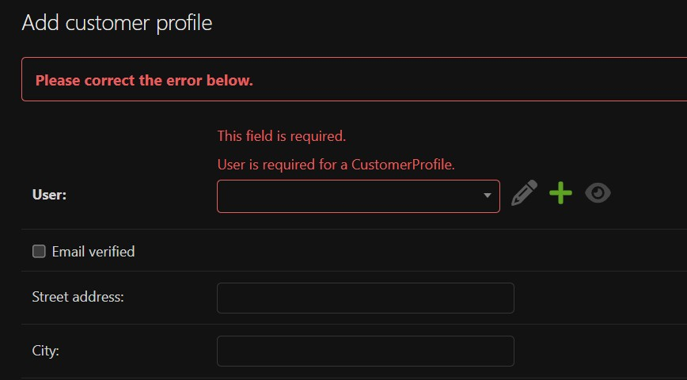
**Figure 2 – Invalid state**  
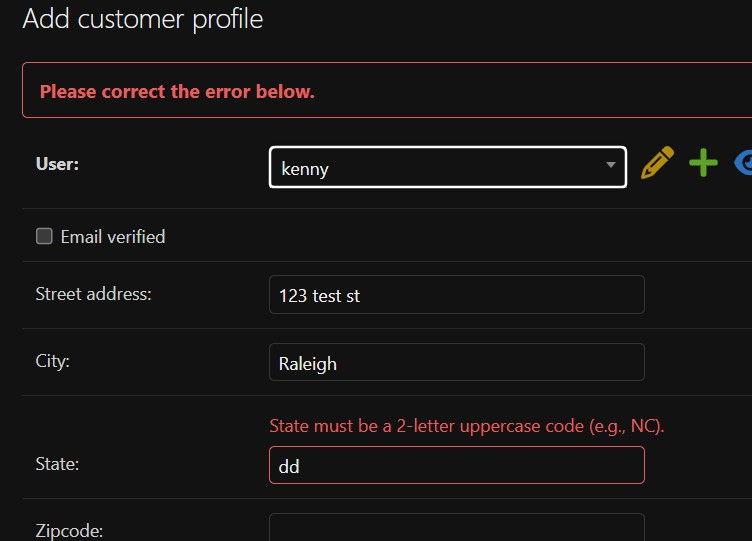
**Figure 3 – valid state**  
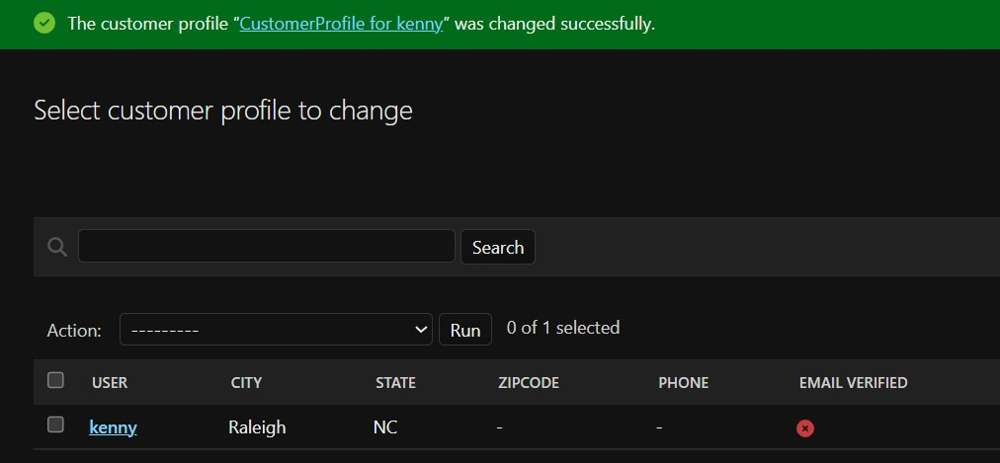
**Figure 4 – Invalid zip**  
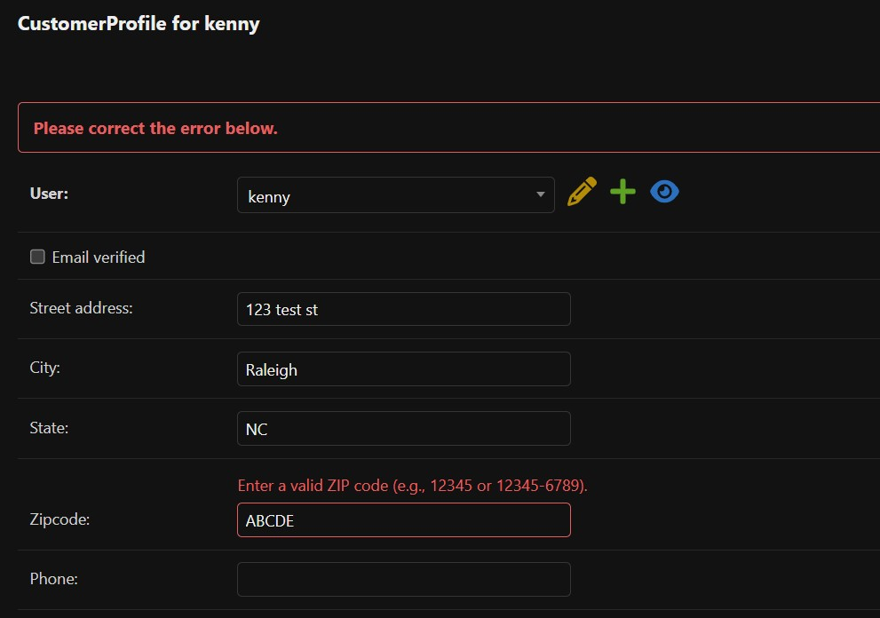
**Figure 5 – Valid zip**  
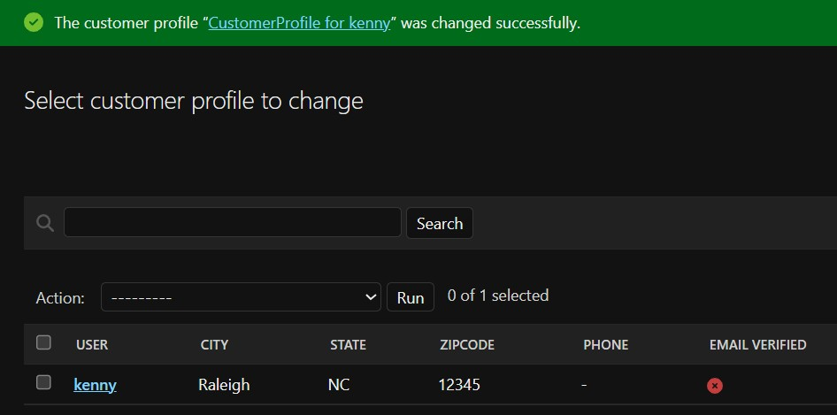
**Figure 6 – Invalid phone**  
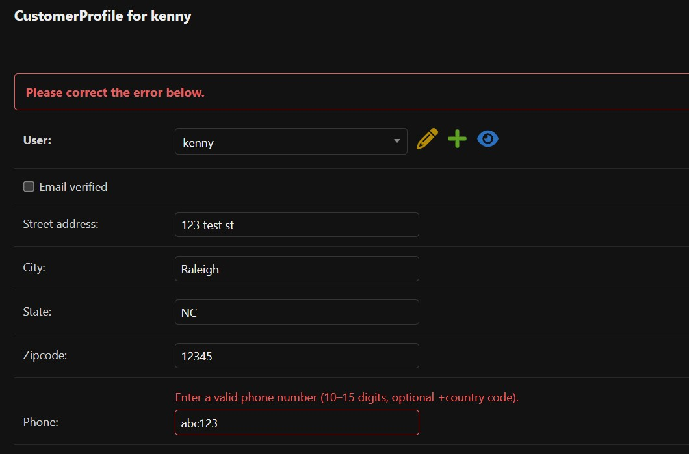
**Figure 7 – Valid phone**  
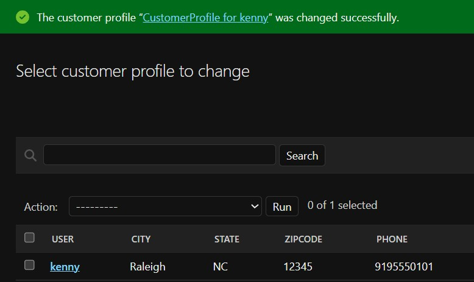
**Figure 8 – Business User Cannot Have Customer Profile**  
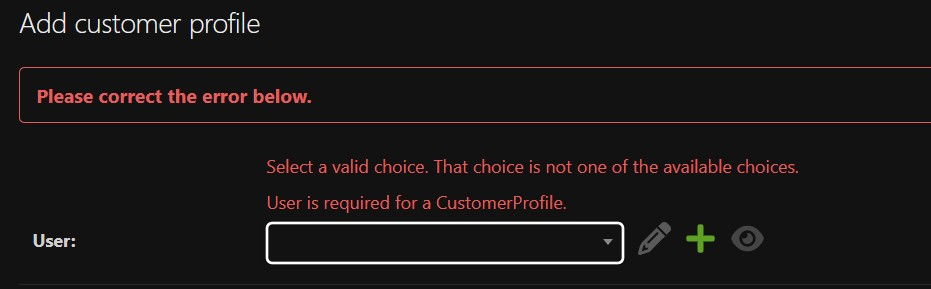
**Figure 9 – Duplicate Profile**  
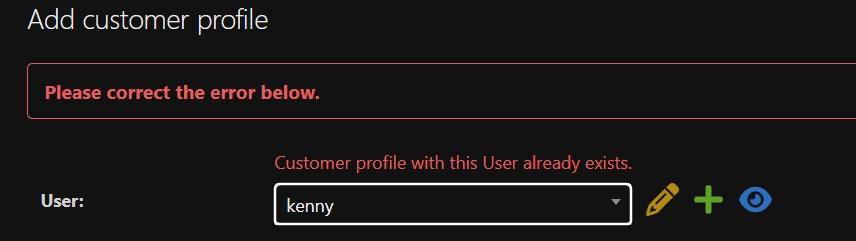
**Figure 10 – Duplicate email API**  
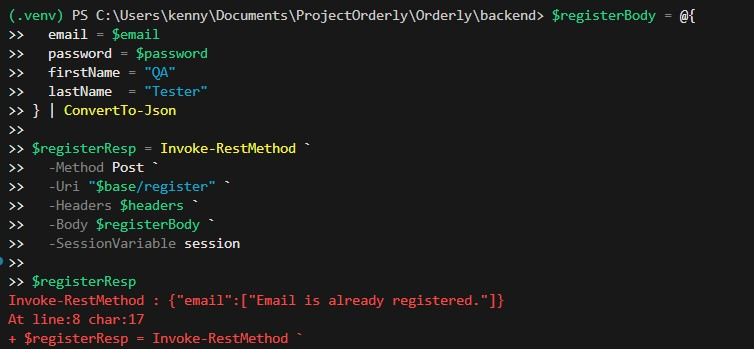
**Figure 11 – Cascade Deletion**  
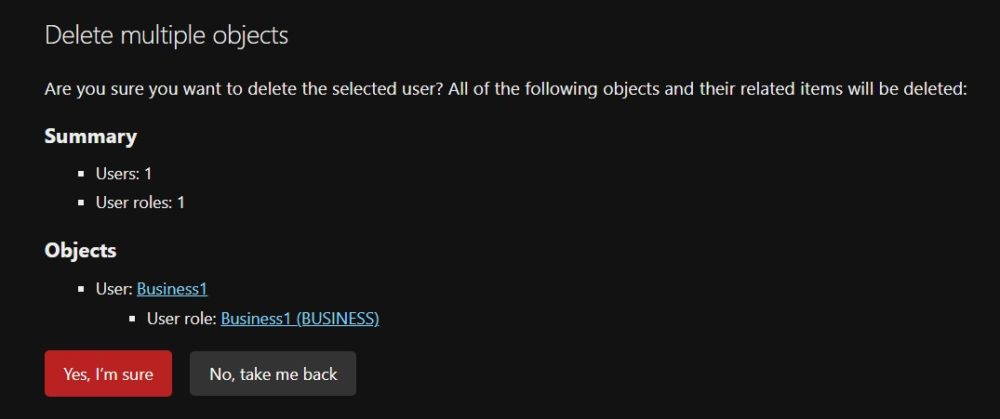

### Status:
PASS

### Notes:
During testing, BUSINESS users appeared in the Django Admin dropdown when selecting a user for CustomerProfile creation. However, model validation correctly prevented the record from being saved, so data integrity requirements for US2.2 were still satisfied.

---

## US2.4 — User Registration

### Test Case ID:
TC-2.4-01

### Feature:
User Registration

### User Story:
As a new user, I want to create an account with my email and password so that I can access the application.

### Preconditions:
- Django backend server running  
- MySQL database connection active  
- Accounts migrations applied  
- Test email does not already exist  

### Test Steps:

1. Send POST request to `/api/v1/auth/register/`  
2. Provide valid JSON payload including:
   - email  
   - password  
   - role  
   - firstName  
   - lastName  
3. Verify HTTP response status indicates success (200 or 201)  
4. Verify response body confirms successful registration  
5. Query `auth_user` table to confirm user record exists  
6. Confirm username equals email  

### Expected Result:

- Registration request succeeds  
- New user record created in `auth_user`  
- Username equals email  
- Structured success response returned  
- No server errors occur  

### Actual Result:
Registration succeeded.  

API Response:
- accessToken returned  
- expiresIn = 3600  
- tokenType = Bearer  
- customer object returned with id, email, role  

Database Verification:
- `auth_user` record created  
- username equals email  
- is_active = 1  

### Status:

PASS

### Notes:


---

## US2.5 — Email Verification

### Test Case ID:
TC-2.5-01

### Feature:
Email Verification

### User Story:
As a user, I want the system to grant me access only to features appropriate for my role (customer or business admin) so that I have a secure and relevant experience.

### Preconditions:
- Backend server running  
- Console email backend enabled  
- Test user successfully registered  
- Unique test email generated  

### Test Steps:
#### Step A – Request Verification Email
1. Send POST request to `/api/v1/auth/email-verification`  
2. Provide JSON payload:
   - email  

**Expected Result**
- Generic response returned  
- No indication whether email exists  
- No server errors  


#### Step B – Capture Verification Link
1. Observe backend console output  
2. Locate verification email  
3. Extract `uid` and `token`  

**Expected Result**
- Verification link displayed in console  
- Token generated successfully  


#### Step C – Confirm Verification (Valid Token)
1. Send POST request to `/api/v1/auth/email-verification/confirm`  
2. Provide:
   - uid  
   - token  

**Expected Result**
- HTTP 200 returned  
- “email verified” message  
- `CustomerProfile.email_verified` set to True  


#### Step D – Confirm Verification (Invalid Token)
1. Repeat confirmation with invalid token  

**Expected Result**
- HTTP 400 returned  
- INVALID_TOKEN error  
- No changes to user record  


### Actual Result
- Verification email successfully generated via manual trigger.  
- Valid token confirmed email successfully.  
- Invalid token properly rejected.  

### Evidence:
**Figure 1 – New User**  
.jpg)
**Figure 2 – Invalid token**  
.jpg)
**Figure 3 – Email Verification**  
.jpg)
**Figure 4 – Resend Verification**  
.jpg)

### Status:
PASS

### Notes:


---

## US2.6 — Backend User Login

### Test Case ID:
TC-2.6-01

### Feature:
Backend User Login

### User Story:
As a registered user, I want to log in to my account so that I can access personalized features.

### Preconditions:
- Registered and verified user exists  
- Known valid password  

### Test Steps:
#### Step A – Valid Login
1. Send POST request to `/api/v1/auth/login`  
2. Provide:
   - email  
   - password  

**Expected Result**
- HTTP 200 returned  
- accessToken provided  
- refreshToken set in HttpOnly cookie  
- customer object returned  


#### Step B – Invalid Password
1. Send login request with incorrect password  

**Expected Result**
- HTTP 400 returned  
- “Email or password is incorrect”  
- No token issued  


#### Step C – Protected Endpoint Without Token
1. Send GET request to `/api/v1/auth/me/` without Authorization header  

**Expected Result**
- HTTP 401 Unauthorized  
- Access denied  


#### Step D – Protected Endpoint With Bearer Token
1. Send GET request to `/api/v1/auth/me/`  
2. Include header:
   - Authorization: Bearer <accessToken>  

**Expected Result**
- HTTP 200 returned  
- User id, email, username, and role returned  


#### Step E – Refresh Token
1. Use stored refresh cookie  
2. Send POST request to `/api/v1/auth/refresh`  

**Expected Result**
- HTTP 200 returned  
- New accessToken issued  

#### Step F – Logout
1. Send POST request to `/api/v1/auth/logout`  
2. Attempt refresh again  

**Expected Result**
- Logout returns success message  
- Refresh token invalidated  
- Subsequent refresh returns 401  


### Actual Result:
- Login successful.  
- Authentication enforcement confirmed.  
- Refresh and logout flow validated successfully.  

### Evidence:
**Figure 1 – Valid Login**  
.jpg)
**Figure 2 – Refresh Token**  
.jpg)
**Figure 3 – Endpoint Without Token**  
.jpg)
**Figure 4 – Endpoint With Token**  
.jpg)
**Figure 5 – Logout Success**  
.jpg)
**Figure 6 – Cookie Deletion**  
.jpg)
**Figure 7 – Invalid credential**  
.jpg)

### Status:
PASS

### Notes:


---

## US2.7 — Backend Password Reset

### Test Case ID:
TC-2.7-01

### Feature:
Backend Password Reset

### User Story:
As a registered user, I want to reset my password so that I can regain access if I forget my credentials.

### Preconditions:
- Registered user exists  
- Console email backend enabled  

### Test Steps:
#### Step A – Request Password Reset
1. Send POST request to `/api/v1/auth/password-reset`  
2. Provide:
   - email  

**Expected Result**
- Generic response returned  
- Reset email generated in console  

#### Step B – Capture Reset Link
1. Extract `uid` and `token` from console email  

**Expected Result**
- Valid reset link generated  

#### Step C – Confirm Password Reset
1. Send POST request to `/api/v1/auth/password-reset/confirm`  
2. Provide:
   - uid  
   - token  
   - newPassword  

**Expected Result**
- HTTP 200 returned  
- “Password has been reset successfully”  
- Password updated in database  

#### Step D – Validate Old Password Fails
1. Attempt login using old password  

**Expected Result**
- Login rejected  
- HTTP 400 returned  

#### Step E – Validate New Password Works
1. Attempt login using new password  

**Expected Result**
- HTTP 200 returned  
- Tokens issued successfully  

### Actual Result
Password reset flow executed successfully.  
Old password invalidated.  
New password validated and login successful.  

### Evidence:
**Figure 1 – Console Reset Email Success**  
.jpg)

**Figure 2 – Confirm Password Reset Success**  
.jpg)

**Figure 3 – Confirm Old Password Fail Success**  
.jpg)

**Figure 4 – Confirm New Password Works Success**  
.jpg)

### Status:
PASS

### Notes:


---

## US2.8 — Backend API Endpoints for Authentication

### Test Case ID:
TC-2.8-01

### Feature:
Backend API Endpoints for Authentication

### User Story:
As a front-end developer, I want backend API endpoints for authentication so that I can integrate user registration, login, and account management into the UI.

### Preconditions:
- Backend API server running
- No Authorization header provided

### Test Steps:
1. Send GET request to `/api/v1/auth/me/`
2. Do not include an Authorization header

### Expected Result:
- System rejects request
- Response returns **401 Unauthorized**
- Error indicates authentication credentials are required

### Actual Result:
Endpoint returned **401 Unauthorized** as expected when no authentication token was provided.

### Evidence:
**Figure 1 – Duplicate Email Registration Error**  
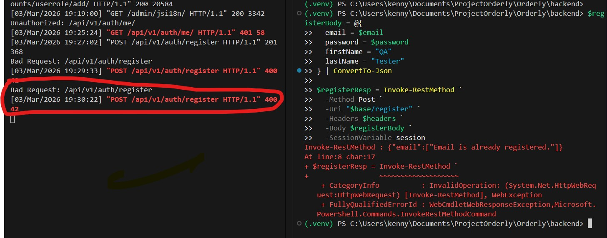

**Figure 2 – Invalid Login Test**  
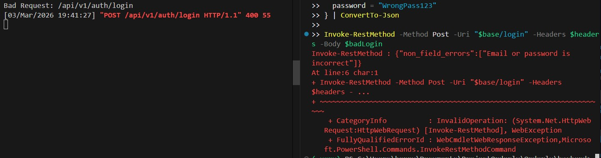

**Figure 3 – Logout Success**  
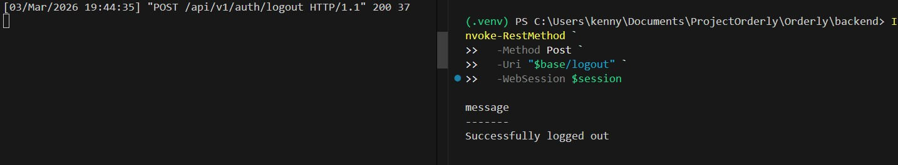

**Figure 4 – Password Reset Confirm Success**  
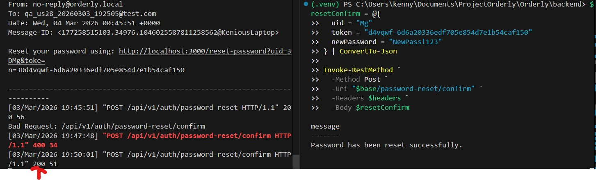

**Figure 5 – Refresh Rejected**  
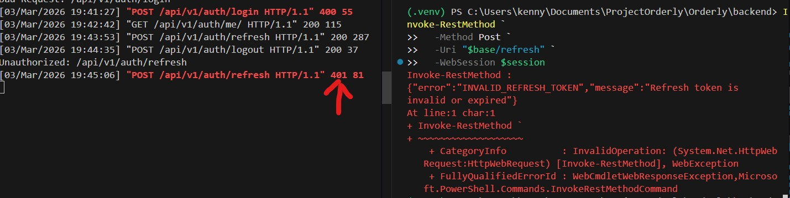

**Figure 6 – Refresh Success**  
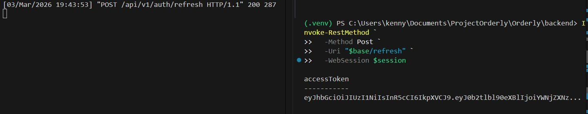

**Figure 7 – Reset Request Response**  
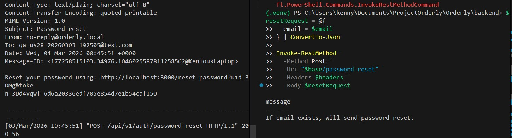

**Figure 8 – Successful Authentication Response**  
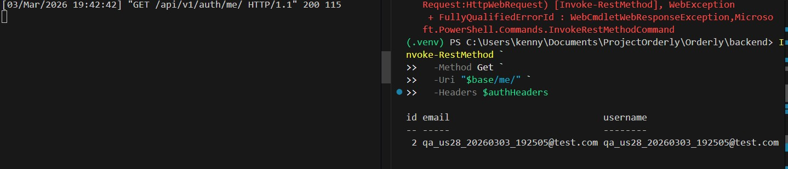

**Figure 9 – Successful Login Response**  
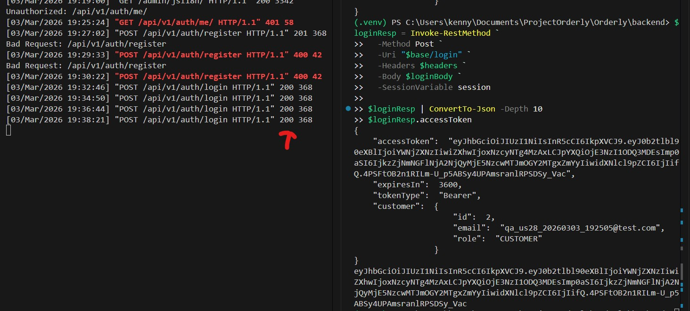

**Figure 10 – Successful Registration**  
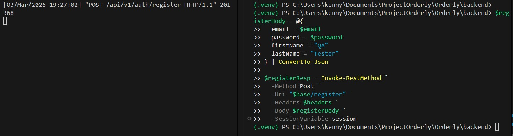

**Figure 11 – Unauthorized Access**  


### Status:
PASS

### Notes:
Confirms protected endpoints reject unauthorized requests.

---

## US2.9 — Frontend Authentication Components

### Test Case ID:
TC-2.9-01

### Feature:
Frontend Authentication Components

### User Story:


### Preconditions:


### Test Steps:


### Expected Result:


### Actual Result:


### Status:


### Notes:


---

## US2.11 — Comprehensive Seed Data Population

### Test Case ID:
TC-2.11-01

### Feature:
Comprehensive Seed Data Population

### User Story:
As a developer, I want realistic seed data populated in the database so that I can test features with representative content and teammates can develop against consistent data.

### Preconditions:
- Application is running locally.
- Database migrations have been applied successfully.
- Database is empty or contains minimal data.
- The seed script `seed_data.py` is available in the project.
- Django environment and dependencies are installed.
- Admin access is available to verify seeded data.

### Test Steps:
1. Open the terminal in the backend project directory.
2. Run the seed script command:
   ```bash
   python manage.py seed_data
3. Confirm the script completes without errors.
4. Start the server:
   
   ```bash
   python manage.py runserver
5. Log into Django Admin.
6. Navigate to the Users section and confirm that multiple sample users were created
7. Navigate to Customer Profiles and verify profiles exist and are linked to users
8. Navigate to Suppliers and confirm supplier records were created.
9. Navigate to Inventory Items and verify inventory records exist.
10. Navigate to Categories and confirm categories were populated.
11. Navigate to Products and verify products were created with realistic names and data.
12. Navigate to Product Variants and confirm variants are linked to products.
13. Navigate to Modifiers and verify modifier records exist.
14. Confirm relationships between records (e.g., Products linked to Categories and Suppliers, CustomerProfiles linked to Users).

### Expected Result:
- Seed script runs successfully without errors.

- Realistic sample data is created for core models.

- Model relationships are populated correctly.

- Team members can run the same command and reproduce the same dataset locally.

### Actual Result:
Seed script executed successfully and populated the database with realistic sample data across all core models. Relationships between models were correctly established and the dataset appeared consistently when verified through Django Admin.

### Evidence:
**Figure 1 – Seed Script Execution**  
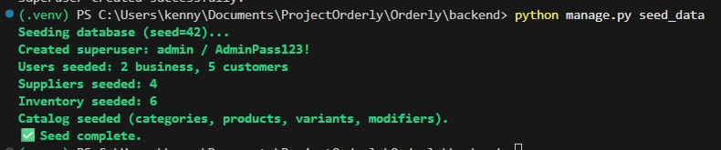

**Figure 2 – Verify Accounts Seed Data (Admin)**  
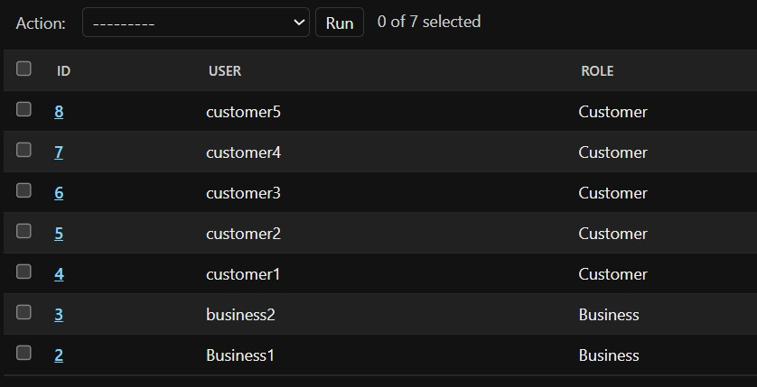

**Figure 3 – Verify Catalog Seed Data**  
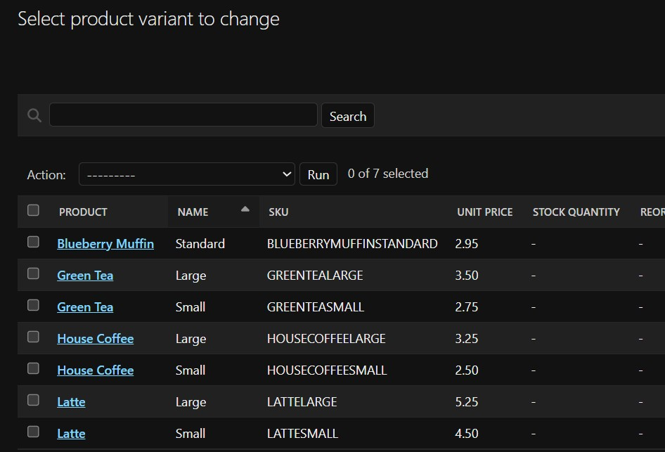

**Figure 4 – Verify Inventory Seed Data**  
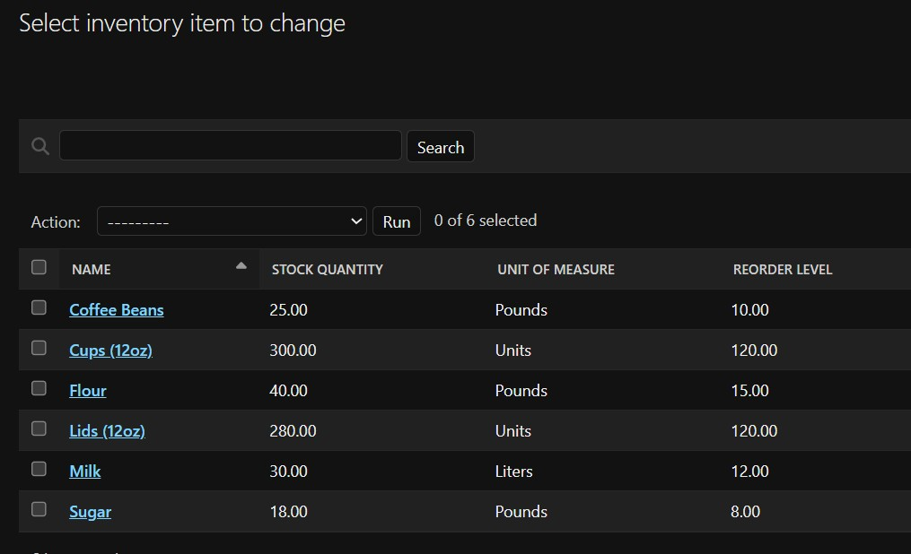

**Figure 5 – Verify Suppliers Seed Data**  
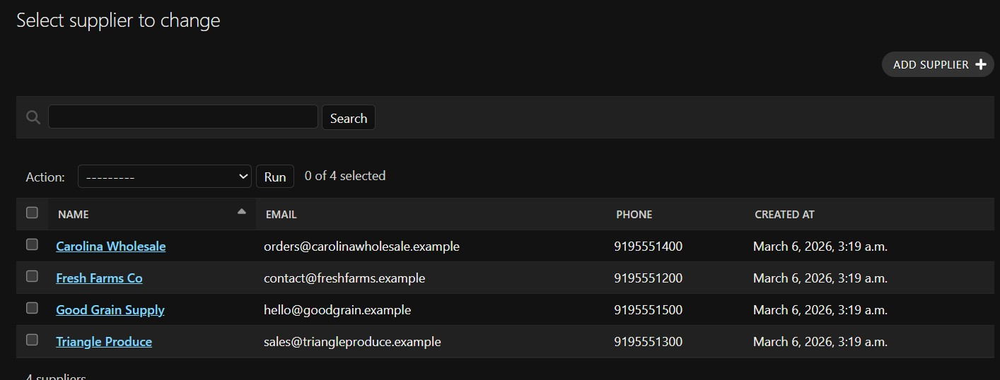

### Status:
PASS

### Notes:
The seed script completed successfully and created representative data across the system. This allows developers and testers to work with consistent sample data during development and testing.

---
