# Sprint 3 Test Cases
Project: **Orderly**
Sprint: **Sprint 3 — Customer Ordering Experience**

---

## US3.1 — Product Browsing

### Test Case ID:
TC-3.1-01

### Feature:
Product Browsing

### User Story:
As a customer, I want to view a list of products with names, prices, and availability so that I can select items to order.

### Preconditions:
- Backend server is running and accessible  
- Frontend application is running at `http://localhost:3000`  
- Database is seeded with product, category, and variant data  
- No authentication required (public storefront access)  

### Test Steps:
1. Navigate to `http://localhost:3000/`  
2. Verify the storefront page loads successfully  
3. Observe the product grid and confirm multiple product cards are displayed  
4. Verify each product card includes:
   - product name  
   - variant dropdown  
   - price  
   - availability (in-stock or out-of-stock)  
5. Select a different variant from the dropdown on a product  
6. Verify the displayed price updates accordingly  
7. Identify an in-stock product and confirm quantity controls (`+ / -`) are visible  
8. Identify an out-of-stock product and confirm “Out of Stock” message is displayed  
9. Locate and interact with the category filter dropdown  
10. Select a category and verify the product list updates  
11. Click “View Details” on a product  
12. Verify navigation to the product detail page  
13. Confirm product detail page displays correct product info and variant selection  

### Expected Result:
- Storefront loads without errors  
- Products are displayed in a grid layout  
- Each product shows name, variant options, price, and availability  
- Variant selection updates product details dynamically  
- In-stock products show quantity controls  
- Out-of-stock products display “Out of Stock”  
- Category filter updates the displayed product list  
- “View Details” navigates to the correct product detail page  
- Product detail page displays accurate information  

### Actual Result:
- Storefront loaded successfully with product grid  
- Product cards displayed correct name, variant, price, and availability  
- Variant selection updated pricing as expected  
- In-stock products displayed quantity controls (UI only)  
- Out-of-stock products correctly showed “Out of Stock”  
- Category filter updated product list correctly  
- “View Details” navigated to the correct product detail page  
- Product detail page displayed correct product and variant information  

### Evidence:
## US3.1 — Product Browsing

### Test Case ID:
TC-3.1-01

### Feature:
Product Browsing

### User Story:
As a customer, I want to view a list of products with names, prices, and availability so that I can select items to order.

---

### Preconditions:
- Backend server is running and accessible  
- Frontend application is running at `http://localhost:3000`  
- Database is seeded with product, category, and variant data  
- No authentication required (public storefront access)  

---

### Test Steps:
1. Navigate to `http://localhost:3000/`  
2. Verify the storefront page loads successfully  
3. Observe the product grid and confirm multiple product cards are displayed  
4. Verify each product card includes:
   - product name  
   - variant dropdown  
   - price  
   - availability (in-stock or out-of-stock)  
5. Select a different variant from the dropdown on a product  
6. Verify the displayed price updates accordingly  
7. Identify an in-stock product and confirm quantity controls (`+ / -`) are visible  
8. Identify an out-of-stock product and confirm “Out of Stock” message is displayed  
9. Locate and interact with the category filter dropdown  
10. Select a category and verify the product list updates  
11. Click “View Details” on a product  
12. Verify navigation to the product detail page  
13. Confirm product detail page displays correct product info and variant selection  

---

### Expected Result:
- Storefront loads without errors  
- Products are displayed in a grid layout  
- Each product shows name, variant options, price, and availability  
- Variant selection updates product details dynamically  
- In-stock products show quantity controls  
- Out-of-stock products display “Out of Stock”  
- Category filter updates the displayed product list  
- “View Details” navigates to the correct product detail page  
- Product detail page displays accurate information  

---

### Actual Result:
- Storefront loaded successfully with product grid  
- Product cards displayed correct name, variant, price, and availability  
- Variant selection updated pricing as expected  
- In-stock products displayed quantity controls (UI only)  
- Out-of-stock products correctly showed “Out of Stock”  
- Category filter updated product list correctly  
- “View Details” navigated to the correct product detail page  
- Product detail page displayed correct product and variant information  

---

### Status:
PASS

---

### Notes:
- Quantity controls are currently UI-only and not functionally tied to cart logic (expected for this user story)  
- Product data is dynamically loaded via API and enriched with variant data  
- Testing included both manual validation and automated coverage (Jest + Robot Framework)

---

### Evidence:

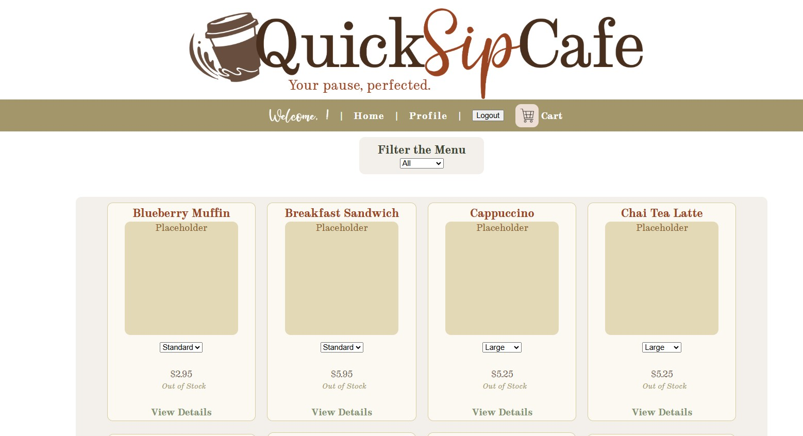

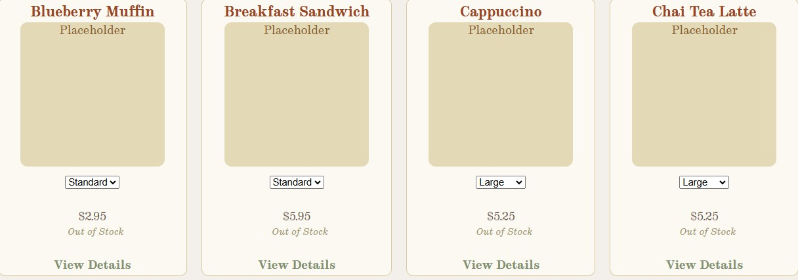

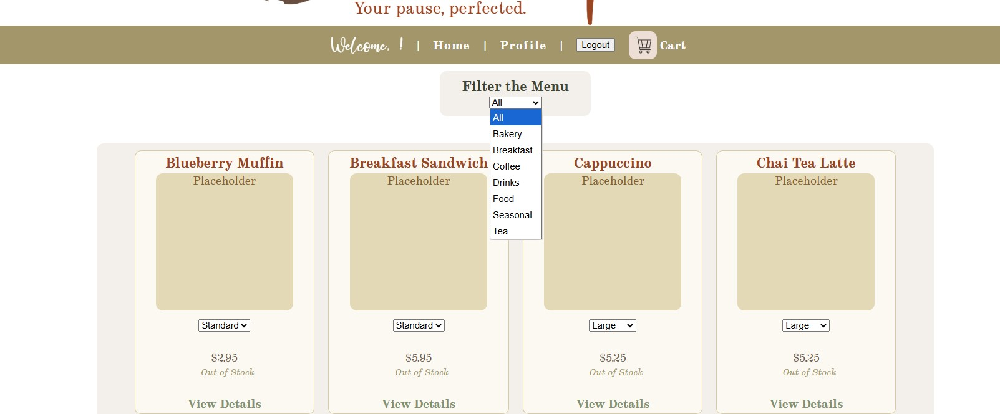

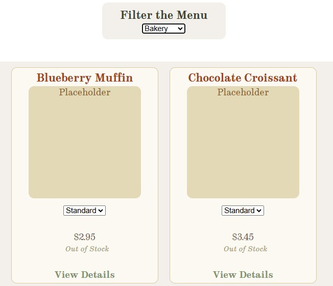

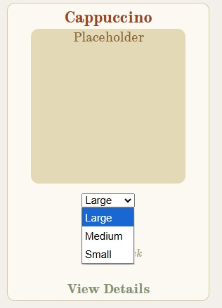

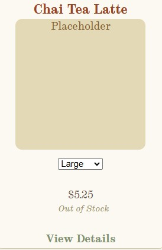

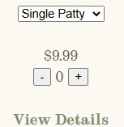

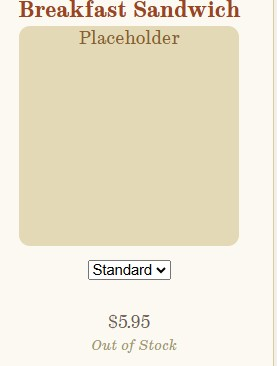

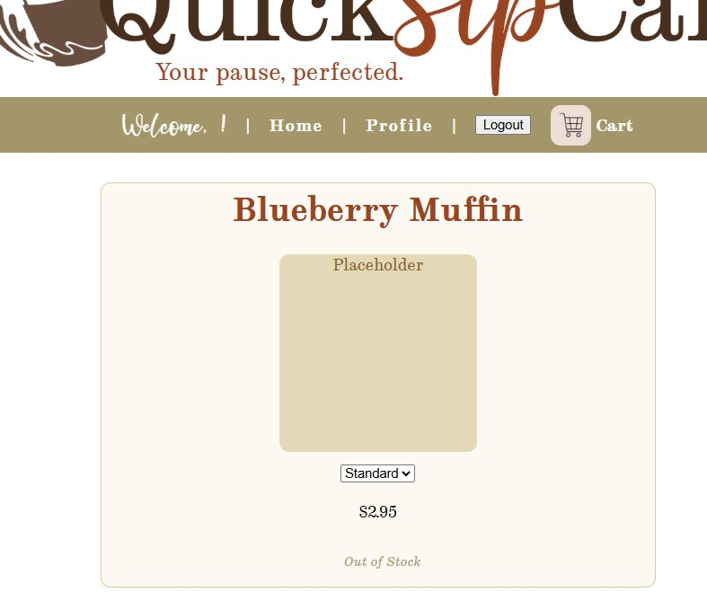

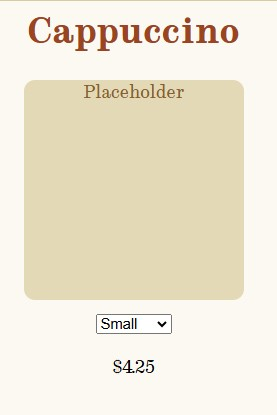

### Status:
PASS

### Notes:

---

## US3.2 — Shopping Cart System (Draft Order)

### Test Case ID:  
TC-3.2.2  

### Feature:  
Draft Order (Cart Management)  

### User Story:  
As a customer, I want to add, remove, and update quantities in my cart and have it saved automatically so I can prepare my order without losing my selections.  

### Preconditions:  
- User is logged in with a valid customer account  
- Second customer account exists for authorization testing  
- A user without a CustomerProfile exists  
- Product variants exist in the database (seed data loaded)  
- API is running and accessible  
- Authorization token is available  

### Test Steps:  

1. Send `POST /api/v1/orders/draft` with valid authentication  
2. Verify draft order is created  

3. Send `POST /api/v1/orders/draft` again  
4. Verify the same draft order is returned (no duplicate created)  

5. Send `POST /api/v1/orders/items` with valid `variantId` and quantity  
6. Verify item is added to the draft order  

7. Send `POST /api/v1/orders/items` again with the same `variantId`  
8. Verify quantity is merged into existing item  

9. Send `PATCH /api/v1/orders/items/{orderItemId}` with updated quantity  
10. Verify quantity updates correctly  

11. Send `PATCH /api/v1/orders/items/{orderItemId}` with quantity = 0  
12. Verify item is removed from cart  

13. Attempt `POST /api/v1/orders/draft` without authentication  
14. Verify request is rejected  

15. Attempt `POST /api/v1/orders/items` without authentication  
16. Verify request is rejected  

17. Attempt cart access with user without CustomerProfile  
18. Verify request is rejected with NOT_AUTHORIZED  

19. Send `POST /api/v1/orders/items` with invalid `variantId`  
20. Verify validation error is returned  

21. Send `POST /api/v1/orders/items` with invalid quantity (0)  
22. Verify validation error is returned  

### Expected Result:  

- Draft order is created and persists per customer  
- Only one active DRAFT order exists per customer  
- Items can be added to the cart  
- Adding the same variant updates quantity instead of creating duplicates  
- Quantities update correctly  
- Items are removed when quantity is set to zero  
- Unauthorized users cannot access or modify cart  
- Users without CustomerProfile cannot access cart  
- Invalid inputs return proper validation errors  
- Inventory quantities remain unchanged  
- Cart state persists across multiple requests  

### Actual Result:  

All operations executed successfully. Draft order creation, item addition, quantity updates, and item removal behaved as expected. Authorization and validation checks correctly blocked invalid and unauthorized requests. Cart persistence and quantity merging worked correctly. No issues observed during testing.  

### Evidence:  

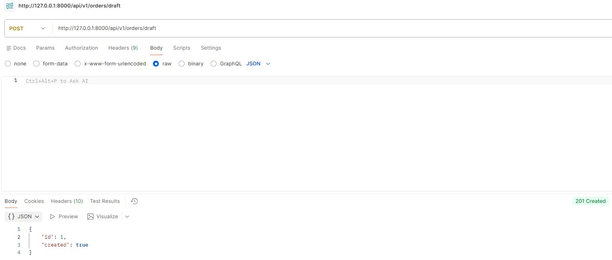

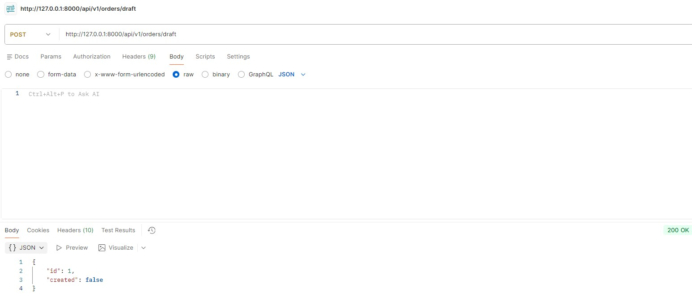

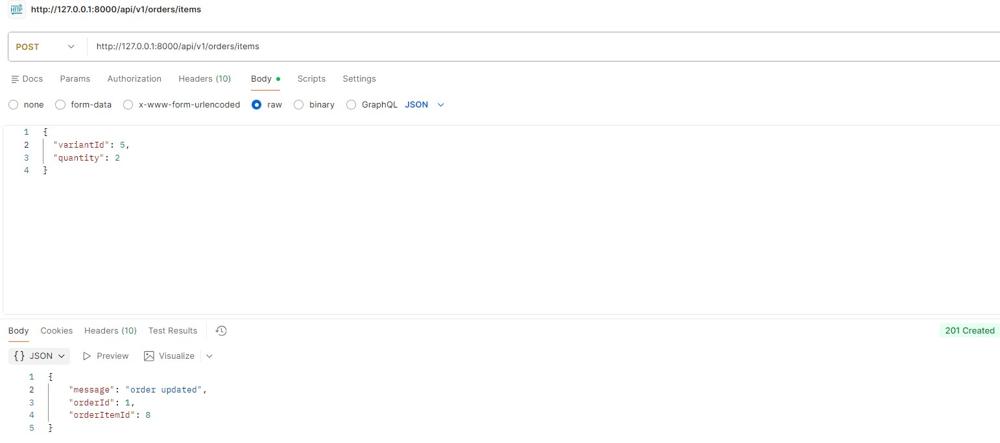

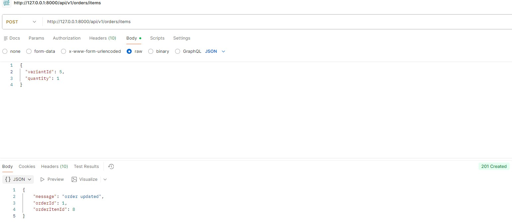

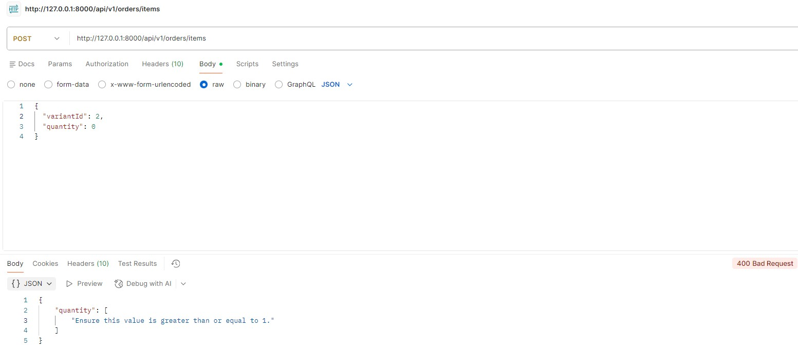

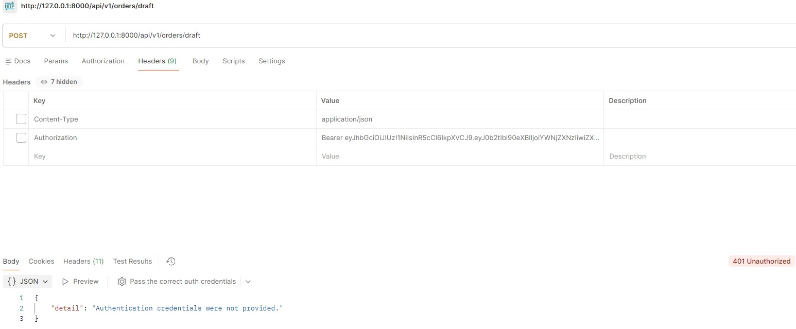

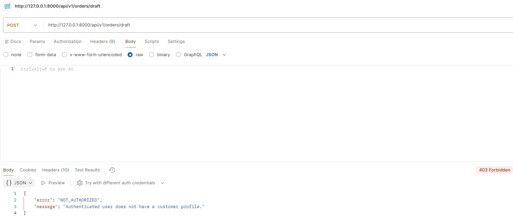

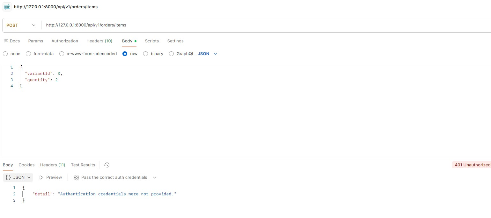

### Status:  
Pass  

### Notes:  

---

## US3.3 — Order Submission (Checkout)

### Test Case ID:  
TC-3.3.2  

### Feature:  
Order Submission / Checkout  

### User Story:  
As a customer, I want to submit my order and see its current status so that I know when it is being prepared or completed.  

### Preconditions:  
- User is registered and logged in with a valid customer account  
- User has a valid JWT token for authentication  
- System is connected to the database  
- Product variants exist in the system  
- User can create and access a DRAFT order  

### Test Steps:  
1. Register and log in as a customer  
2. Create or retrieve a DRAFT order using `/api/v1/orders/draft`  
3. Add a valid item to the draft order using `/api/v1/orders/items`  
4. Submit the order using `/api/v1/orders/{orderId}/submit` with valid request body  
5. Verify order status updates to `PENDING`  
6. Attempt to submit the same order again  
7. Create a new user and attempt to submit an empty draft order  
8. Submit an order with missing required request body fields  
9. Attempt to submit another user’s order  
10. Attempt to submit an order without authentication  

### Expected Result:  
- Valid draft order submission returns `200` and status changes to `PENDING`  
- Submitting a non-DRAFT order returns `400 INVALID_INPUT`  
- Submitting an empty order returns `400 INVALID_INPUT`  
- Missing required fields return validation errors  
- Unauthorized user receives `403 NOT_AUTHORIZED`  
- Unauthenticated user receives `401`  
- Failed submissions do not change order status (remains `DRAFT`)  

### Actual Result:  
- Valid draft order successfully submitted and status updated to `PENDING`  
- Re-submitting the same order returned `400 INVALID_INPUT` with message indicating only DRAFT orders can be submitted  
- Submitting an empty draft returned `400 INVALID_INPUT`  
- Missing required request body fields returned validation errors  
- Unauthorized user attempting to submit another user’s order returned `403 NOT_AUTHORIZED`  
- Unauthenticated request returned `401`  
- Failed submissions correctly left orders in `DRAFT` status  

### Evidence:  

**Valid Draft Order Submission**  
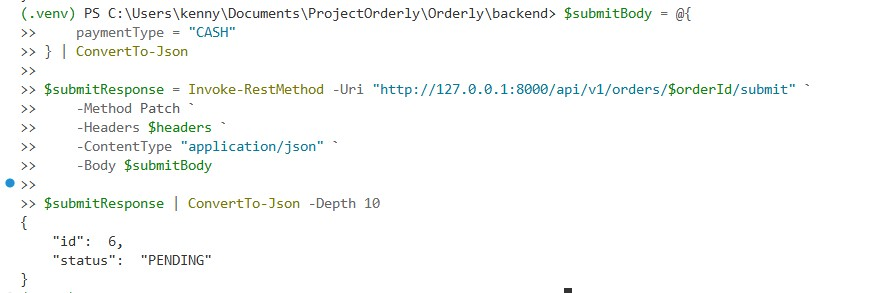

**Draft Add + Submit Flow**  
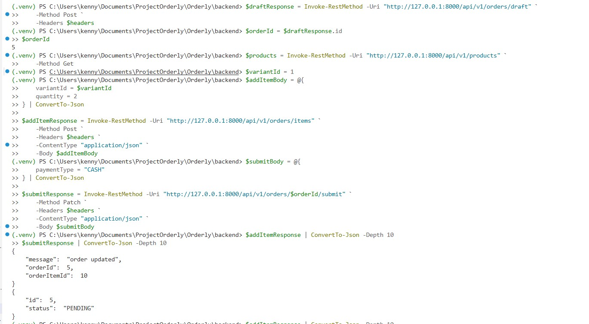

**Add Item to Draft Order**  
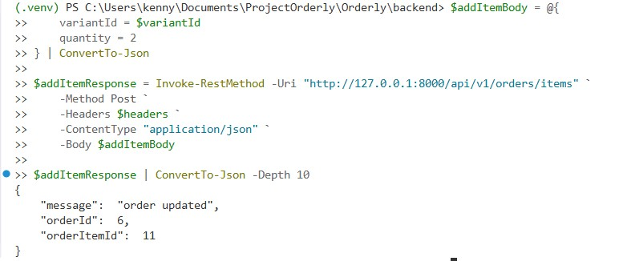

**Empty Draft Submission Failure**  
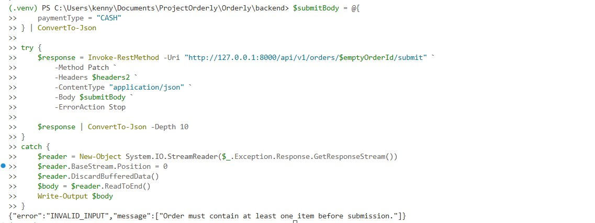

**Empty Order Failure**  
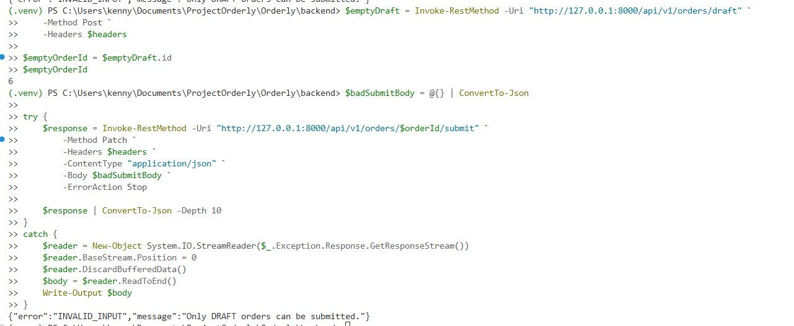

**Missing Required Info Error**  
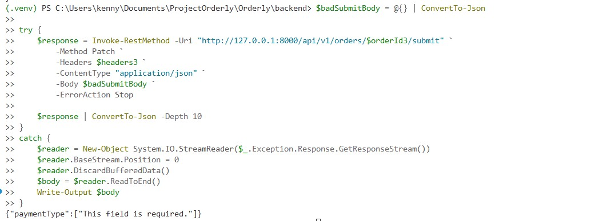

**Unauthorized User Error**  
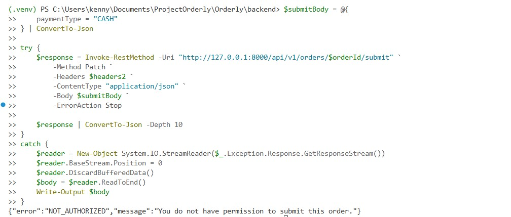

**Unauthenticated User Error**  
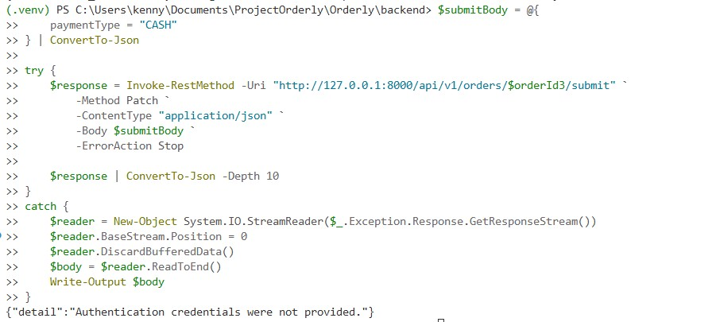

**Re-submitting Same Order Failure**  
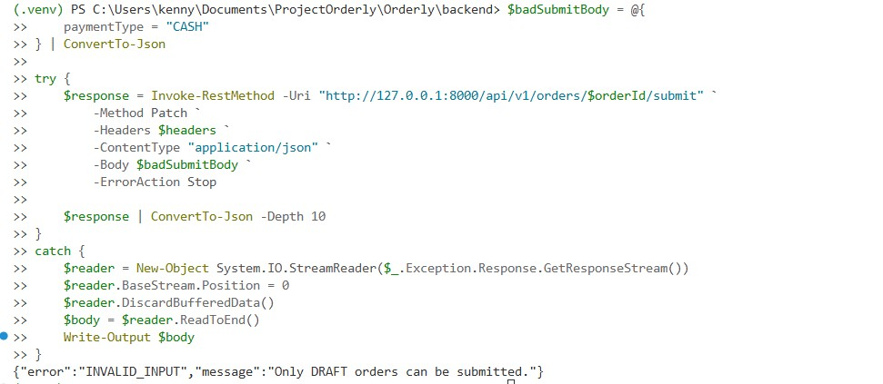

**Failed Submit Leaves Order in DRAFT**  

### Status:  
Pass ✅  

### Notes:  
- Endpoint requires `paymentType` despite API contract not specifying request parameters (potential mismatch to log)  
- All validation paths and error handling behaved as expected  
- Manual testing performed via PowerShell and validated against automated test results  

---

## US3.4 — Order Confirmation

### Test Case ID:
TC-3.4-01

### Feature:
Order Confirmation

### User Story:
As a customer, I want to see a confirmation screen with my receipt after placing an order so that I have immediate proof of my purchase.

### Preconditions:
- User account exists with valid credentials (e.g., orderhistory1@test.com)
- User has at least one submitted (non-draft) order in the system
- Backend order submission and retrieval endpoints are functional
- Frontend application is running and accessible
- User is logged into the application

### Test Steps:
1. Log in using a valid customer account with existing orders
2. Navigate to the "Order History" page from the navigation menu
3. Verify that at least one order is displayed
4. Click on an order entry (e.g., "Order #23")
5. Observe navigation to the order detail page (`/orders/{orderId}`)
6. Review the displayed order confirmation details

### Expected Result:
- User is successfully navigated to the order detail (confirmation) page
- The page displays:
  - Order number (Order #)
  - Date of the order
  - Order status
  - List of items in the order
  - Item details (product name, quantity, unit price, item total)
  - Totals section (tax and total amount)
- The confirmation page accurately reflects the order data returned from the API
- Page loads without errors

### Actual Result:
- User successfully navigated from Order History to Order Detail page
- Confirmation page displayed all required fields:
  - Order number, date, status, items, and totals
  - Item-level details (quantity, unit price, item total)
- Data matched backend response
- No UI or rendering issues observed

### Evidence:
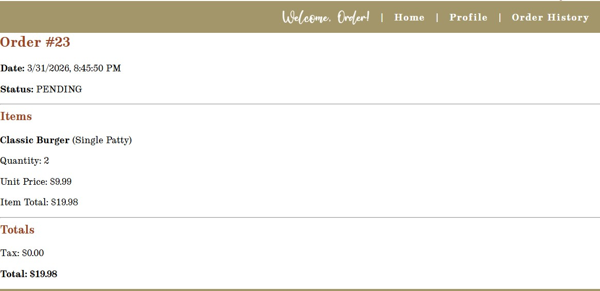

### Status:
PASS

### Notes:

---

## US3.5 — Order History

### Test Case ID:
TC-3.5-01

### Feature:
Order History

### User Story:
As a customer, I want to view my previous orders so that I can reorder my favorites quickly.

### Preconditions:
- User account exists with valid credentials (e.g., orderhistory1@test.com)
- User has at least one submitted (non-draft) order
- Backend order history endpoint (`/api/v1/orders/me`) is functional
- Frontend application is running and accessible
- User is logged into the application

### Test Steps:
1. Log in using a valid customer account
2. Navigate to the "Order History" page from the navigation menu
3. Verify that a list of previous orders is displayed
4. Confirm each order displays:
   - Order number (Order #)
   - Date
   - Status
   - Total amount
5. Click on an order entry
6. Verify navigation to the order detail page (`/orders/{orderId}`)
7. (Optional) Use pagination controls (Next/Previous) if multiple pages exist

### Expected Result:
- Order History page loads successfully
- A list of past (non-draft) orders is displayed
- Each order includes order number, date, status, and total
- Clicking an order navigates to the corresponding order detail page
- Pagination works correctly when applicable
- Empty state message ("No past orders found.") is displayed if no orders exist
- Page loads without errors

### Actual Result:
- Order History page loaded successfully
- Orders displayed with correct details (order number, date, status, total)
- Clicking an order successfully navigated to the order detail page
- Pagination controls displayed and functioned correctly (if applicable)
- No UI or data issues observed

### Evidence:
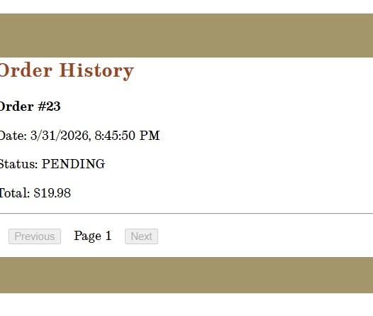

### Status:
PASS

### Notes:

---

## US3.6.2 — User Profile Management

### Feature
Customer Profile Management

### User Story
As a customer, I want to update my profile information so that my contact details stay current.

### Endpoints Tested
- GET `/api/v1/users/me/`
- PATCH `/api/v1/users/me/`

### TC-3.6.2-01 – Authenticated User Can View Profile

### Preconditions
- Customer account exists
- User is authenticated
- CustomerProfile record exists

### Test Steps
1. Send GET request to `/api/v1/users/me/`
2. Include Authorization header

    Authorization: Bearer <access_token>

3. Submit request

### Expected Result
- API returns **200 OK**
- Response contains user profile information including:
  - first_name
  - last_name
  - email
  - phone
  - address fields

### Actual Result
Profile data returned successfully.

### Evidence
**View Profile Endpoint**  
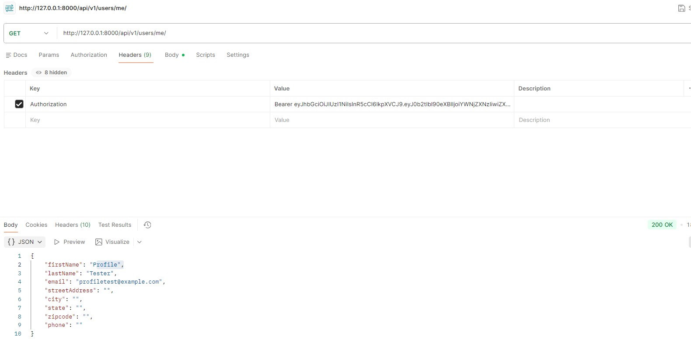

### Status
Pass

### TC-3.6.2-02 – Unauthorized User Cannot View Profile

### Preconditions
- API server running

### Test Steps
1. Send GET request to `/api/v1/users/me/`
2. Do **not** include Authorization header

### Expected Result
- API returns **401 Unauthorized**

### Actual Result
Unauthorized access correctly rejected.

### Status
Pass

### TC-3.6.2-03 – User Can Update Name

### Preconditions
- Authenticated user
- Existing CustomerProfile record

### Test Steps
1. Send PATCH request to `/api/v1/users/me/`
2. Include Authorization header
3. Request body:

    {
      "firstName": "John",
      "lastName": "Doe"
    }

4. Submit request

### Expected Result
- API returns **200 OK**
- User name is updated

### Actual Result
Name updated successfully.

### Evidence
**Update Name**  
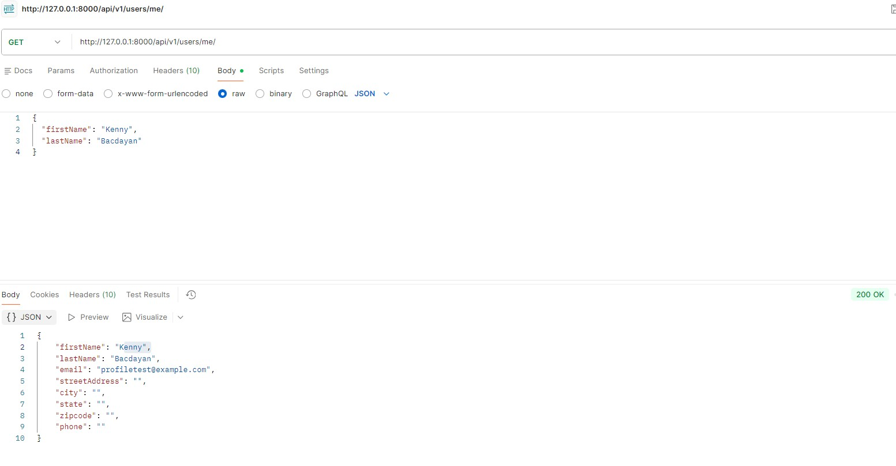

### Status
Pass

### TC-3.6.2-04 – User Can Update Address

### Preconditions
- Authenticated user
- Existing CustomerProfile record

### Test Steps
1. Send PATCH request to `/api/v1/users/me/`
2. Include Authorization header
3. Request body:

    {
      "address": "123 Test Street"
    }

4. Submit request

### Expected Result
- API returns **200 OK**
- Address updated successfully

### Actual Result
Address updated successfully.

### Evidence
**Update Address**  
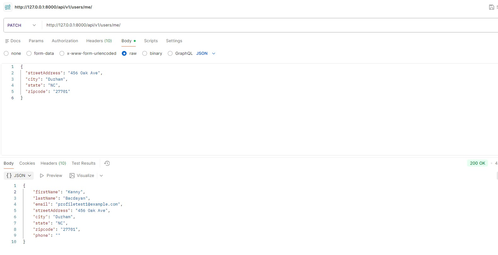

### Status
Pass

### TC-3.6.2-05 – User Can Update Email

### Preconditions
- Authenticated user
- Existing CustomerProfile record

### Test Steps
1. Send PATCH request to `/api/v1/users/me/`
2. Include Authorization header
3. Request body:

    {
      "email": "newemail@test.com"
    }

4. Submit request

### Expected Result
- API returns **200 OK**
- Email updated successfully
- Email verification triggered if required

### Actual Result
Email updated successfully.

### Evidence
**Update Email**  
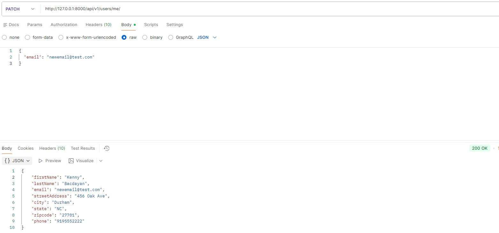

### Status
Pass

### TC-3.6.2-06 – User Can Update Phone Number

### Preconditions
- Authenticated user
- Existing CustomerProfile record

### Test Steps
1. Send PATCH request to `/api/v1/users/me/`
2. Include Authorization header
3. Request body:

    {
      "phone": "9195551234"
    }

4. Submit request

### Expected Result
- API returns **200 OK**
- Phone number updated successfully

### Actual Result
Phone updated successfully.

### Evidence
**Update Phone**  
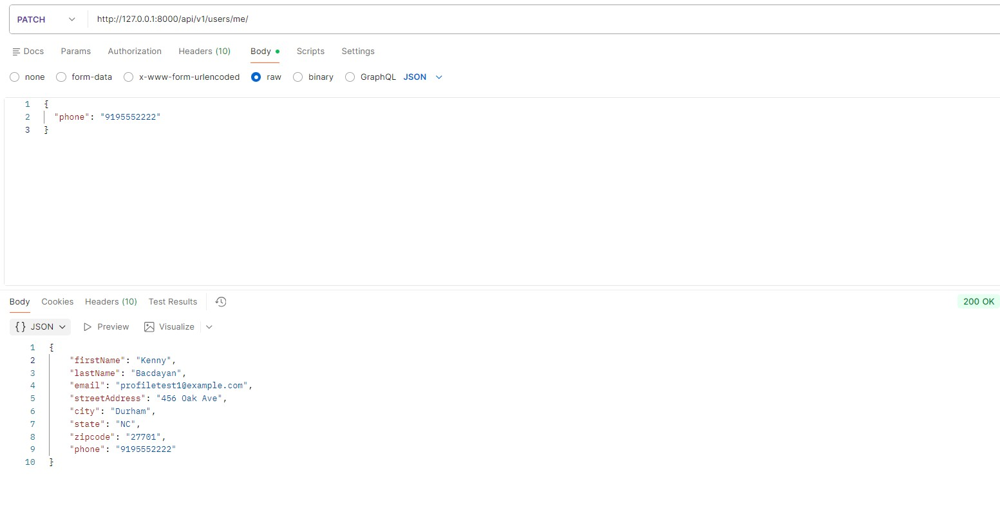

### Status
Pass

### TC-3.6.2-07 – Partial Profile Update Works

### Preconditions
- Authenticated user

### Test Steps
1. Send PATCH request to `/api/v1/users/me/`
2. Include Authorization header
3. Request body:

    {
      "phone": "9195559999"
    }

### Expected Result
- API returns **200 OK**
- Only phone field updates
- Other profile fields remain unchanged

### Actual Result
Partial update works correctly.

### Evidence
**Partial Profile Update**  
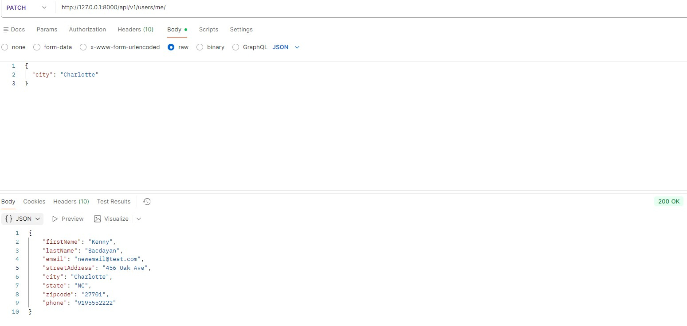

### Status
Pass

### TC-3.6.2-08 – Duplicate Email Validation

### Preconditions
- Two users exist in system

### Test Steps
1. Send PATCH request to `/api/v1/users/me/`
2. Attempt to update email to an existing user email

    {
      "email": "existing@email.com"
    }

### Expected Result
- API returns **400 Bad Request**
- Validation error indicating email already exists

### Actual Result
Duplicate email correctly rejected.

### Evidence
**Duplicate Email Validation**  
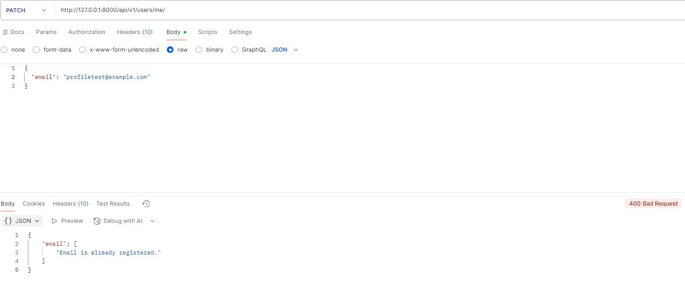

### Status
Pass

### TC-3.6.2-09 – Invalid Phone Validation

### Test Steps
Send request body:

    {
      "phone": "abc123"
    }

### Expected Result
- API returns **400 Bad Request**
- Phone validation error

### Actual Result
Validation error returned correctly.

### Evidence
**Invalid Phone Input**  
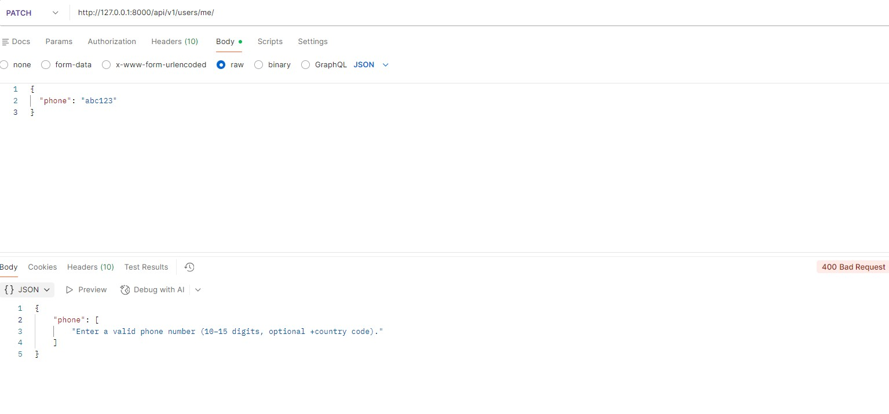

### Status
Pass

### TC-3.6.2-10 – Invalid State Validation

### Test Steps
Send request body:

    {
      "state": "North Carolina"
    }

### Expected Result
- API returns **400 Bad Request**
- Validation error indicating state must be two-letter code

### Actual Result
Validation error returned correctly.

### Evidence
**Invalid State Input**  
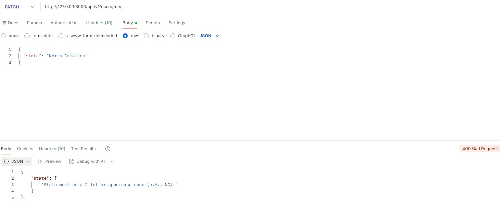

### Status
Pass

### TC-3.6.2-11 – Invalid Zipcode Validation

### Test Steps
Send request body:

    {
      "zipcode": "27"
    }

### Expected Result
- API returns **400 Bad Request**
- Validation error indicating invalid zipcode format

### Actual Result
Validation error returned correctly.

### Evidence
**Invalid Zipcode Input**  
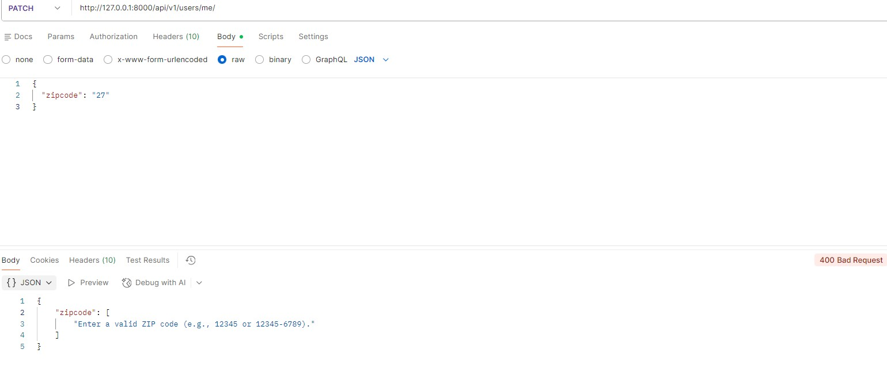

### Status
Pass

### Test Summary

| Test Case | Description | Result |
|----------|-------------|--------|
| TC-3.6.2-01 | View profile | Pass |
| TC-3.6.2-02 | Unauthorized access | Pass |
| TC-3.6.2-03 | Update name | Pass |
| TC-3.6.2-04 | Update address | Pass |
| TC-3.6.2-05 | Update email | Pass |
| TC-3.6.2-06 | Update phone | Pass |
| TC-3.6.2-07 | Partial update | Pass |
| TC-3.6.2-08 | Duplicate email validation | Pass |
| TC-3.6.2-09 | Invalid phone validation | Pass |
| TC-3.6.2-10 | Invalid state validation | Pass |
| TC-3.6.2-11 | Invalid zipcode validation | Pass |

### Overall Result
All acceptance criteria for **US3.6 – Customer Profile Update** were successfully validated.  
Profile viewing, profile updates, authentication protection, and input validation all function as expected.

---

## US3.7 — Order Item Customization (Modifiers)

### Test Case ID:
TC-3.7-01

### Feature:
Order Item Customization

### User Story:
As a customer, I want to customize items (extras or options) so that my order matches my preferences.

### Preconditions:
- Application is running (frontend + backend)
- Seed data is loaded (products, variants, modifiers)
- User is on the storefront page
- At least one product with modifiers exists (e.g., Latte, Breakfast Sandwich)

### Test Steps:
1. Navigate to the storefront.
2. Select a product with modifiers (e.g., Latte) by clicking **View Details**.
3. Verify product customization page loads.
4. Select a different variant (if applicable).
5. Observe modifier groups displayed for the selected variant.
6. Select an option from a single-select modifier group (radio buttons).
7. Select multiple options from a multi-select modifier group (checkboxes).
8. Attempt to exceed the maximum allowed selections in a multi-select group.
9. Verify additional options become disabled or cannot be selected.
10. Observe the total price updating as modifier options are selected.
11. Navigate to a product with a required modifier group (e.g., Breakfast Sandwich).
12. Verify required modifier group is displayed.

### Expected Result:
- Product customization page loads successfully with correct product details.
- Variant selection updates modifier groups dynamically.
- Modifier groups and options display correctly.
- Single-select groups allow only one selection.
- Multi-select groups allow multiple selections within defined limits.
- Maximum selection rules are enforced (extra options disabled or blocked).
- Total price updates correctly based on selected modifiers.
- Required modifier groups are clearly displayed.

### Actual Result:
- Product customization page loaded successfully.
- Variants updated modifier groups correctly.
- Modifier groups and options rendered as expected.
- Radio button behavior enforced single selection correctly.
- Checkbox behavior allowed multiple selections within limits.
- Maximum selection constraint enforced by disabling additional options.
- Total price updated dynamically based on selected modifiers.
- Required modifier group (Bread Choice) displayed correctly.

### Evidence:
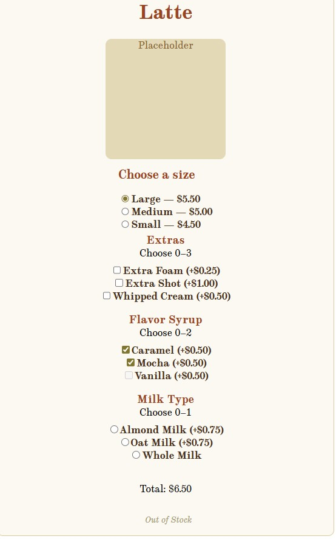

### Status:
PASS

### Notes:

---

## US3.8 — Seed Data (Products, Variants, Modifiers)

### Test Case ID:
TC-3.8-01

### Feature:
Seed Data & Content

### User Story:
As a developer, I want extended seed data so the team can develop and test Sprint 3 features against realistic content.

### Preconditions:
- Latest project code pulled from repository.
- Local development environment configured and virtual environment activated.
- Database migrations applied successfully.
- Local database reset or in a clean state before executing seed script.

### Test Steps:
1. Reset database to ensure reproducible seed execution.
2. Run the seed script using:

   python manage.py seed_data

3. Observe terminal output to confirm the script completes without errors.
4. Open Django shell and verify products were created:

   from catalog.models import Product
   Product.objects.count()

5. Verify product variants exist and contain populated SKU and unit price fields.

   from catalog.models import ProductVariant
   ProductVariant.objects.filter(product__name="Latte")

6. Verify modifier groups were created for variants.

   from catalog.models import ModifierGroup
   ModifierGroup.objects.count()

7. Verify modifier options exist with correct price adjustments.

   from catalog.models import ModifierOption
   ModifierOption.objects.filter(group__name="Milk Type")

8. Validate hierarchical relationships:

   Product → ProductVariant → ModifierGroup → ModifierOption

   Example queries:

   latte = Product.objects.get(name="Latte")
   latte.variants.all()

   v = latte.variants.first()
   v.modifier_groups.all()

   g = v.modifier_groups.first()
   g.options.all()

9. Reset the database again and rerun the seed script to confirm dataset reproducibility.

### Expected Result:

- Seed script executes successfully without runtime or database errors.
- Database is populated with realistic dataset including products, variants, and modifiers.
- Variants contain valid SKU and pricing values.
- Modifier groups and options exist and contain correct price adjustments.
- Relationships between products, variants, modifier groups, and options are valid.
- Seed script can be executed again from a clean database and reproduce the dataset.

### Actual Result:

Seed script executed successfully using `python manage.py seed_data`. Products, variants, modifier groups, and modifier options were created as expected. Field-level verification confirmed variants contained populated SKU and unit price values, and modifier options contained appropriate price adjustments. Relationship validation confirmed the hierarchy between Product, ProductVariant, ModifierGroup, and ModifierOption objects. The seed script was executed again after resetting the database and reproduced the dataset successfully.

### Evidence:

### Test Evidence

**Figure 1 – Seed Script Execution**

**Figure 2 – Products Verified**

**Figure 3 – Variants Exist**

**Figure 4 – Product Variant Details**

**Figure 5 – Modifier Groups**

**Figure 6 – Modifier Options**

**Figure 7 – Relationship Validation**

### Status:
PASS

### Notes:
Initial inspection queries displayed object string representations that did not include price fields due to the model `__str__` implementation. Additional queries were used to verify `unit_price` and `price_adjustment` fields directly. Duplicate modifier option names across variants are expected because modifier groups are created per variant in the seed dataset.