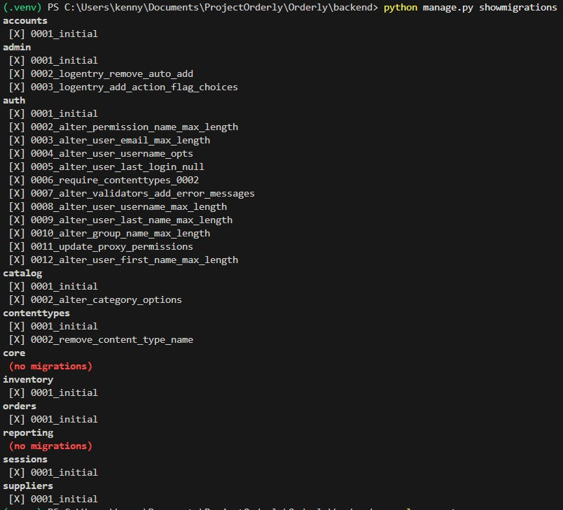
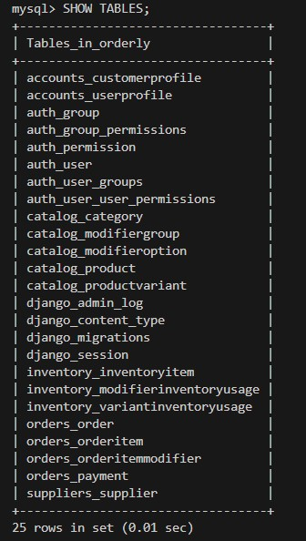

# Sprint 2 Test Cases – Orderly  
**Sprint 2 Scope:** Database, Authentication, RBAC & Application Shell  

---

## Overview

Sprint 2 establishes the **core system foundation** required for future feature development.  
Primary deliverables include:

- Database schema implementation and validation  
- User authentication (registration, login, password reset)  
- Role-Based Access Control (RBAC)  
- Backend/frontend authentication integration  
- Application shell and navigation structure  

This document defines **formal QA test cases** for foundational and security-critical features.  
Execution occurs **after feature completion and prior to Sprint Review**.

---

# Formal Test Cases — Core Infrastructure & Security

---

## TC-04 – Database Schema Migration & Relational Integrity

### Feature  
Database Schema Implementation  

### User Story (2.1) 
As a developer, I want the core database schema successfully migrated and relationally enforced so that the application can reliably store and retrieve structured data.

### Preconditions
- MySQL server running locally  
- Clean database available  
- Django configured for MySQL  
- Sprint 2 migrations present for:
  - accounts  
  - catalog  
  - inventory  
  - suppliers  
  - orders  

### Test Steps

#### Step A — Migration Integrity
1. Run `python manage.py makemigrations`  
2. Run `python manage.py migrate`  
3. Re-run `python manage.py migrate`  
4. Run `python manage.py showmigrations`  

**Expected Result**
- No migration errors  
- Second migrate shows **no pending migrations**  
- All Sprint 2 migrations marked **applied**

---

#### Step B — Physical Schema Verification
1. Connect to MySQL  
2. Execute `SHOW TABLES;`  
3. Query foreign keys via `INFORMATION_SCHEMA.KEY_COLUMN_USAGE`  

**Expected Result**
- Core domain tables exist  
- Django system tables exist  
- Foreign key constraints enforced across apps  

---

#### Step C — Relational Usability (Happy Path)
1. Open Django shell  
2. Create linked records:

   Supplier → Category → Product → ProductVariant →  
   CustomerProfile → Order → OrderItem  

**Expected Result**
- Records save successfully  
- Foreign keys resolve correctly  
- Duplicate product constraint enforced  
- No ORM or database integrity errors  

---

### Actual Result
All migrations applied successfully.  
MySQL verification confirmed table creation and enforced foreign keys.  
Linked relational records created successfully.  
Duplicate product constraint correctly enforced.

### Evidence

**Figure 1 – Successful migration execution**  

**Figure 2 – showmigrations confirmation**  

**Figure 3 – MySQL table creation**  

**Figure 4 – Relational record creation in Django shell**  

### Status  
**PASS**

### Notes  
Confirms foundational database readiness required for all Sprint 2 features.

---

## TC-05 – User Registration (Valid Input)

### Feature  
User Registration  

### User Story  
As a new user, I want to create an account so that I can access the application.

### Preconditions
- Application running  
- Registration endpoint available  
- No existing account with test email  

### Test Steps
1. Navigate to registration page  
2. Enter valid email  
3. Enter valid password  
4. Submit form  

### Expected Result
- Account created successfully  
- Password stored **hashed**  
- Optional verification email sent  
- Success confirmation displayed  

### Actual Result  
_To be executed_

### Status  
Not Executed – Awaiting Implementation

---

## TC-06 – User Registration (Duplicate Email)

### Feature  
Registration Validation  

### Preconditions
- Existing account with test email  

### Test Steps
1. Attempt registration with duplicate email  
2. Submit form  

### Expected Result
- Registration blocked  
- Clear error shown  
- No duplicate user created  

### Actual Result  
_To be executed_

### Status  
Not Executed – Awaiting Implementation

---

## TC-07 – User Login (Valid Credentials)

### Feature  
User Login  

### User Story  
As a registered user, I want to log in to access my personalized features.

### Preconditions
- Verified user account exists  

### Test Steps
1. Navigate to login page  
2. Enter valid email  
3. Enter correct password  
4. Submit form  

### Expected Result
- Authentication succeeds  
- Redirected to correct dashboard  
- Session or token created  

### Actual Result  
_To be executed_

### Status  
Not Executed – Awaiting Implementation

---

## TC-08 – User Login (Invalid Password)

### Feature  
Login Validation  

### Preconditions
- Registered user exists  

### Test Steps
1. Enter valid email  
2. Enter incorrect password  
3. Submit form  

### Expected Result
- Login fails  
- Error message displayed  
- No session/token created  

### Actual Result  
_To be executed_

### Status  
Not Executed – Awaiting Implementation

---

## TC-09 – Role-Based Access Control (RBAC)

### Feature  
Access Enforcement  

### User Story  
As an administrator, I want access restricted by role so users only access permitted features.

### Preconditions
- Customer account exists  
- Admin account exists  

### Test Steps
1. Log in as customer  
2. Attempt admin-only route  
3. Observe response  
4. Log in as admin  
5. Access admin route  

### Expected Result
- Customer receives **403 Forbidden**  
- Admin access granted  
- Unauthorized API requests blocked  

### Actual Result  
_To be executed_

### Status  
Not Executed – Awaiting Implementation

---

## TC-10 – Password Reset Flow

### Feature  
Password Recovery  

### User Story  
As a user, I want to reset my password via email if I forget it.

### Preconditions
- Registered user exists  
- Email system configured  

### Test Steps
1. Request password reset  
2. Receive reset email  
3. Open reset link  
4. Enter new password  
5. Submit  

### Expected Result
- Reset link valid and time-limited  
- Password updated successfully  
- Old password invalid  
- Token cannot be reused  

### Actual Result  
_To be executed_

### Status  
Not Executed – Awaiting Implementation

---

## TC-11 – Database Constraint Validation

### Feature  
Data Integrity & Validation  

### User Story  
As a developer, I want database constraints enforced so invalid data cannot be stored.

### Preconditions
- Database migrated  
- Test data available  

### Test Steps
1. Attempt duplicate user email  
2. Attempt negative inventory quantity  
3. Attempt missing required field  

### Expected Result
- Duplicate rejected  
- Negative values rejected  
- Required field validation enforced  
- Database integrity preserved  

### Actual Result  
_To be executed_

### Status  
Not Executed – Awaiting Implementation

---

# Sprint 2 Testing Strategy Summary

Sprint 2 testing prioritizes:

### Security
- Authentication correctness  
- Password handling  
- RBAC enforcement  

### Data Integrity
- Schema migration success  
- Foreign key enforcement  
- Constraint validation  

### System Foundation
- Application shell readiness  
- Backend/frontend auth integration  
- Stable base for Sprint 3 features  

---

# QA Execution Plan

**Execution Timing:**  
After feature completion and before Sprint Review.

**Regression Testing:**  
Performed after code freeze.

**Defect Tracking:**  
All failures logged in the **Trello defect board** with severity and reproduction steps.
